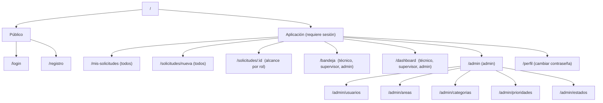
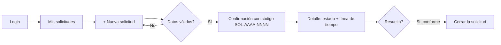
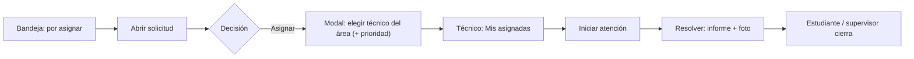

# Diseño UX/UI: Wireframes, Sistema de Diseño y Prototipo

> **Objetivo (TS-11, OE-2):** diseñar la experiencia **antes** de construir el frontend: usuarios, flujos, wireframes, sistema de diseño, prototipo y evaluación de usabilidad.
> Este documento contiene los **wireframes de baja fidelidad** y la **especificación** que alimenta los mockups de alta fidelidad y el prototipo clicable en **Figma** (TASK-003).
> Relacionados: [SRS](especificaciones-tecnicas.md) · [API REST](../02-diseno/api-rest.md) · [Estrategia de pruebas §7](../03-calidad-y-operacion/estrategia-pruebas.md#7-pruebas-funcionales-de-aceptación-y-de-usuario)

### Estado de los artefactos

| Artefacto | Estado | Ubicación |
|:---|:---:|:---|
| Usuarios y necesidades (§1) | ✅ Listo | este documento |
| Arquitectura de información y flujos (§3, §4) | ✅ Listo | este documento |
| Wireframes de baja fidelidad (§5) | ✅ Listo | este documento (ASCII, versionable en Git) |
| Sistema de diseño: tokens y componentes (§2) | ✅ Especificado | este documento → se implementa en `frontend/src/styles/tokens.css` |
| Mockups de alta fidelidad | ⏳ Pendiente (Rol 4, TASK-003, 09/10) | Figma — **añadir enlace aquí:** `<URL de Figma>` |
| Prototipo clicable | ⏳ Pendiente (Rol 4, TASK-003, 09/10) | Figma — **añadir enlace aquí** |
| Maqueta HTML/CSS/JS con API simulada (§6) | ⏳ Pendiente (Roles 4 y 5, TASK-033) | `frontend-prototipo/` cuando exista |
| Evaluación de usabilidad (§7) | ⏳ Pendiente (Fase IV) | informe de pruebas |

---

## 1. Usuarios y necesidades

| Persona | Contexto | Objetivo principal | Frustraciones actuales | Dispositivo típico |
|:---|:---|:---|:---|:---|
| **Camila, estudiante** (20 años) | Entre clases, de pie en un pabellón | Reportar un problema en 1–2 minutos y saber si lo atienden | "Mandé un correo y nadie respondió"; no sabe a quién recurrir | **Móvil** |
| **Carlos, técnico de TI** (32) | En campo, con una tablet o móvil; a veces en la oficina | Saber qué tiene asignado hoy y registrar lo que hizo | Recibe pedidos por WhatsApp sin detalle ni fotos | Móvil/tablet |
| **Ana, supervisora de TI** (41) | En oficina con PC; revisa varias veces al día | Asignar rápido y ver qué está vencido o atrasado | Sin visibilidad de carga por técnico; reporta en Excel | **Escritorio** |
| **Marco, administrador** (38) | Configura el sistema ocasionalmente | Mantener usuarios y catálogos sin pedir ayuda al desarrollador | Cambios que requieren tocar la BD | Escritorio |

### Principios de diseño (derivados de los usuarios)

1. **Móvil primero para quien reporta y atiende; densidad de información para quien supervisa.**
2. **Siempre saber "en qué estado está y qué sigue":** estado visible, línea de tiempo, siguiente acción evidente.
3. **Mostrar solo lo permitido:** los botones salen de `accionesPermitidas` del backend, no se muestran acciones que fallarán.
4. **Prevenir errores antes que explicarlos:** validación en vivo, límites visibles (contador de caracteres, tamaño de archivo).
5. **Mensajes humanos y accionables** (§9), nunca códigos técnicos sin explicación.
6. **Consistencia:** mismos componentes, mismos colores de estado, mismo lugar para las acciones principales.

---

## 2. Sistema de diseño

Se implementa como **variables CSS** (`tokens.css`) usadas por todos los componentes, para cambiar la identidad visual (p. ej. colores de la universidad) en un solo lugar.

### 2.1 Color

| Token | Valor | Uso | Contraste sobre blanco |
|:---|:---:|:---|:---:|
| `--color-primary` | `#1D4ED8` | Acciones principales, enlaces | 6.7:1 ✅ AA |
| `--color-primary-hover` | `#1E40AF` | Hover/foco de botón primario | 8.7:1 ✅ |
| `--color-text` | `#111827` | Texto principal | 17:1 ✅ |
| `--color-text-muted` | `#4B5563` | Texto secundario | 7.5:1 ✅ |
| `--color-surface` / `--color-bg` | `#FFFFFF` / `#F3F4F6` | Tarjetas / fondo | — |
| `--color-border` | `#D1D5DB` | Bordes | — |
| `--color-success` | `#047857` | Éxito | 5.5:1 ✅ |
| `--color-warning` | `#B45309` | Advertencia | 5.0:1 ✅ |
| `--color-danger` | `#B91C1C` | Error / acciones destructivas | 6.5:1 ✅ |
| `--color-focus` | `#2563EB` (anillo 3 px) | Foco visible de teclado | — |

**Colores de estado** (de `estados_solicitud.color_hex`, editables por el administrador):

| Estado | Color | Presentación |
|:---|:---:|:---|
| Registrada | `#6B7280` | Gris |
| En evaluación | `#D97706` | Ámbar |
| Asignada | `#2563EB` | Azul |
| En atención | `#7C3AED` | Violeta |
| Resuelta | `#059669` | Verde |
| Cerrada | `#047857` | Verde oscuro |

> **Accesibilidad de la insignia de estado:** el color `#D97706` (≈ 3.2:1) **no alcanza** contraste AA como texto sobre blanco. Por eso la insignia usa un **fondo tintado (color al 12 %) con texto oscuro `--color-text`** y un **punto o icono del color del estado**; el color nunca es el único indicador (siempre hay texto + icono). Esto aplica también a las gráficas (patrones/etiquetas además de color).

**Modo oscuro:** fuera del alcance mínimo; los tokens permiten añadirlo después con `@media (prefers-color-scheme: dark)`.

### 2.2 Tipografía y espaciado

| Elemento | Especificación |
|:---|:---|
| Familia | `Inter`, con *fallback* `system-ui, -apple-system, "Segoe UI", Roboto, sans-serif` |
| Escala (rem) | Cuerpo 1 · Pequeño 0.875 · H3 1.25 · H2 1.5 · H1 2 · Interlineado 1.5 |
| Espaciado | Escala de 4 px: `4, 8, 12, 16, 24, 32, 48` (`--space-1…7`) |
| Radio / sombra | `--radius: 8px`; sombra suave de tarjeta; sin sombras agresivas |
| Tamaño táctil | Mínimo **44 × 44 px** para botones y controles en móvil |

### 2.3 Rejilla y *breakpoints* (mobile-first)

| Nombre | Ancho | Comportamiento |
|:---|:---:|:---|
| **xs** (base) | 360 px+ | 1 columna; navegación inferior/menú hamburguesa; tablas → tarjetas |
| **md** | ≥ 768 px | 2 columnas; barra lateral colapsable |
| **lg** | ≥ 1024 px | Barra lateral fija; tablas completas; KPIs en 4 columnas |
| **xl** | ≥ 1440 px | Contenido con ancho máximo 1280 px centrado |

Verificado en **375×667** y **1920×1080** (RNF-05), sin *scroll* horizontal de la página.

### 2.4 Inventario de componentes reutilizables

| Componente | Variantes / estados | Notas |
|:---|:---|:---|
| `Button` | primario, secundario, peligro, enlace · normal, hover, foco, deshabilitado, **cargando (spinner)** | Se deshabilita mientras envía (evita doble envío) |
| `Input`, `Select`, `Textarea` | normal, foco, **error (texto + borde + icono)**, deshabilitado | Etiqueta siempre visible (no solo *placeholder*); `aria-describedby` al error |
| `FileUploader` | vacío, arrastrando, con vista previa, error | Muestra tamaño y límite (5 MB); máx. 3 |
| `EstadoBadge` | los 6 estados | Texto + punto de color |
| `PrioridadTag` | baja, media, alta, crítica | Icono distinto por nivel |
| `Table` / `CardList` | con orden, filtros, paginación · en móvil se convierte en tarjetas | |
| `Modal` | confirmación, formulario | Atrapa el foco; `Esc` cierra; devuelve foco |
| `Toast` | éxito, error, info | `role="status"/"alert"`; se descarta solo (éxito) |
| `Timeline` | eventos del historial | Línea vertical con estado, actor y hora local |
| `KpiCard` | valor, etiqueta, tendencia opcional | |
| `Chart` (Recharts) | pastel/dona, barras | Con leyenda, etiquetas y tabla alternativa accesible |
| `EmptyState` | sin datos, sin resultados, sin permisos | Explica qué hacer |
| `Skeleton` / `Spinner` | cargando | Evita saltos de diseño |

### 2.5 Estados de interfaz que **toda** pantalla debe diseñar

**Carga** (esqueleto) · **Vacío** (primer uso/sin datos, con llamada a la acción) · **Error** (con reintento y código de soporte `traceId`) · **Sin permiso** (403/404) · **Éxito** (confirmación) · **Sin conexión** (aviso).

---

## 3. Arquitectura de información



### Menú por rol

| Opción | Estudiante | Técnico | Supervisor | Admin |
|:---|:-:|:-:|:-:|:-:|
| Mis solicitudes / Nueva solicitud | ✓ | ✓ | ✓ | ✓ |
| Bandeja (asignadas / del área / todas) | — | ✓ | ✓ | ✓ |
| Dashboard | — | ✓ (propio) | ✓ (su área) | ✓ (global) |
| Administración | — | — | — | ✓ |
| Perfil | ✓ | ✓ | ✓ | ✓ |

---

## 4. Mapa de navegación y flujos

### 4.1 Redirección tras iniciar sesión (por rol)

| Rol | Pantalla inicial | Motivo |
|:---|:---|:---|
| Estudiante | `/mis-solicitudes` | No tiene dashboard; su necesidad es seguir sus solicitudes |
| Técnico | `/bandeja` | Lo primero que necesita es lo asignado |
| Supervisor | `/bandeja` (pestaña "Por asignar") | Despachar es su tarea principal |
| Admin | `/dashboard` | Visión global |

> Corrige la contradicción de la v1.0 ("todos a `/dashboard`") — ver [ADR-registro de conflictos #24](../02-diseno/decisiones-arquitectura.md#registro-de-conflictos-resueltos-versión-10--20).

### 4.2 Flujo del estudiante: registrar y seguir una solicitud



### 4.3 Flujo del supervisor y el técnico



---

## 5. Wireframes de baja fidelidad

Convención: `[ ]` campo · `( )` opción · `[Botón]` · `▼` desplegable · `░` imagen/archivo · `■` elemento destacado. Se muestran versión **móvil (375 px)** o **escritorio** según la pantalla más representativa; el comportamiento responsive de las demás se describe debajo.

### W-01 · Inicio de sesión (móvil)

```
┌─────────────────────────────┐
│        [logo universidad]   │
│   Servicios Universitarios  │
│                             │
│  Correo institucional       │
│  [ nombre@universidad.edu ] │
│                             │
│  Contraseña                 │
│  [ ••••••••••       👁 ]    │
│                             │
│  [      Iniciar sesión    ] │  ← deshabilitado si hay errores
│                             │     (spinner mientras envía)
│  ¿Olvidaste tu contraseña?  │
│  ─────────────────────────  │
│  ¿Primera vez? Regístrate   │
└─────────────────────────────┘
 Error (toast rojo): "Credenciales inválidas"
```

### W-02 · Registro de estudiante (móvil)

```
┌─────────────────────────────┐
│  ← Crear cuenta             │
│  Código institucional       │
│  [ U20261045            ]   │
│  Nombres        Apellidos   │
│  [ Juan      ] [ Pérez   ]  │
│  Correo institucional       │
│  [ juan@universidad.edu ]   │
│  ⚠ Debe usar correo institucional (@universidad.edu)
│  Contraseña                 │
│  [ ••••••••          👁 ]   │
│  ✔ 8 caracteres ✔ 1 mayúscula ✖ 1 número   ← checklist en vivo
│  [     Crear cuenta      ]  │
└─────────────────────────────┘
```

### W-03 · Nueva solicitud (móvil)

```
┌─────────────────────────────┐
│ ← Nueva solicitud           │
│ Título *                    │
│ [ Proyector sin imagen   ]  │
│ Categoría *      Prioridad *│
│ [ Equipos de…  ▼ ] [ Alta ▼]│
│ Campus *                    │
│ [ Campus Central       ▼ ]  │
│ Ubicación (aula/lab) *      │
│ [ Pabellón B - Aula 402  ]  │
│ Descripción *               │
│ [                         ] │
│ [                         ] │
│                    38 / 500 │  ← contador; mín. 15
│ Evidencias (opcional)       │
│ ┌ ─ ─ ─ ─ ─ ─ ─ ─ ─ ─ ─ ┐  │
│   Arrastra o toca para      │
│   subir  JPG·PNG·PDF ≤ 5 MB │
│ └ ─ ─ ─ ─ ─ ─ ─ ─ ─ ─ ─ ┘  │
│ ░ foto1.jpg  1.5 MB   [✕]   │
│                             │
│ [ Cancelar ] [ ■ Enviar  ]  │
└─────────────────────────────┘
 Después: pantalla de confirmación → "✔ Registrada: SOL-2026-0150"
          [Ver mi solicitud]  [Registrar otra]
```
*Escritorio:* formulario en 2 columnas (datos | descripción y evidencias), borrador guardado en `sessionStorage`.

### W-04 · Mis solicitudes

```
┌ Móvil ──────────────────────┐   ┌ Escritorio ───────────────────────────────────────────┐
│ Mis solicitudes   [+ Nueva] │   │ Mis solicitudes                          [+ Nueva]     │
│ [Todas▼] [🔍 código/título] │   │ Estado [Todas ▼]  Buscar [__________]  Desde [__] Hasta│
│ ┌─────────────────────────┐ │   │ ┌────────────┬──────────────┬────────┬──────────┬─────┐│
│ │ SOL-2026-0150   ● Asign.│ │   │ │ Código     │ Título       │ Estado │ Prioridad│Fecha││
│ │ Proyector sin imagen    │ │   │ ├────────────┼──────────────┼────────┼──────────┼─────┤│
│ │ Alta · hace 2 h         │ │   │ │SOL-2026-150│ Proyector…   │●Asign. │ Alta     │ …   ││
│ └─────────────────────────┘ │   │ │SOL-2026-141│ Wi-Fi caído  │●Cerrada│ Media    │ …   ││
│ ┌─────────────────────────┐ │   │ └────────────┴──────────────┴────────┴──────────┴─────┘│
│ │ SOL-2026-0141 ● Cerrada │ │   │ Página 1 de 3        [‹ Anterior] [Siguiente ›]        │
│ └─────────────────────────┘ │   └────────────────────────────────────────────────────────┘
│  (vacío: "Aún no tienes     │
│   solicitudes. [Crear una]")│
└─────────────────────────────┘
```

### W-05 · Detalle de solicitud con línea de tiempo (escritorio)

```
┌──────────────────────────────────────────────────────────────────────────────┐
│ ← Volver     SOL-2026-0150   ● En atención        Prioridad: ▲ Alta          │
│ Proyector sin imagen                              SLA: vence en 18 h  ✔ a tiempo
├───────────────────────────────────────────┬──────────────────────────────────┤
│ Descripción                               │ Datos                            │
│ El proyector del aula B-402 enciende…     │ Categoría: Equipos de Cómputo    │
│                                           │ Área: Tecnologías de la Info.    │
│ Ubicación: Campus Central · Pab. B-402    │ Solicitante: Juan Pérez          │
│                                           │ Técnico: Carlos Ruiz             │
│ Evidencias                                │ Registrada: 03/10/2026 10:04     │
│ ░ foto_proyector.jpg (1.5 MB)             ├──────────────────────────────────┤
│                                           │ ACCIONES (según accionesPermitidas)
│ Línea de tiempo                           │ [ ■ Resolver ] [ Comentar ]      │
│  ● 10:04 Registrada — Juan Pérez          ├──────────────────────────────────┤
│  │                                        │ Comentarios                      │
│  ● 10:30 Evaluada — Ana Torres            │ Carlos: Llevo cable de repuesto  │
│  │                                        │ 🔒 (privado cuadrilla) …         │
│  ● 10:30 Asignada a Carlos Ruiz           │ [ Escribe un comentario…  ] [↵]  │
│  ● 11:15 En atención — Carlos Ruiz        │ ☐ Privado (solo cuadrilla)       │
└───────────────────────────────────────────┴──────────────────────────────────┘
 Móvil: una columna; acciones en barra fija inferior; timeline colapsable.
```

### W-06 · Bandeja del supervisor + modal de asignación (escritorio)

```
┌─ Menú ──┬──────────────────────────────────────────────────────────────────────┐
│ Mis sol.│ Bandeja · Área: Tecnologías de la Información                        │
│ ■Bandeja│ [Por asignar (7)] [En curso (12)] [Resueltas (4)] [Todas]            │
│ Dashbrd │ Estado▼  Prioridad▼  Categoría▼  Técnico▼  🔍 código/título  ☐ Vencidas
│ Notif.  │ ┌──────────┬────────────────┬────────┬────────┬────────────┬────────┐│
│ Perfil  │ │ Código   │ Título         │Prioridad│ Estado │ SLA        │ Acción ││
│         │ ├──────────┼────────────────┼────────┼────────┼────────────┼────────┤│
│         │ │SOL-…0150 │ Proyector…     │ ▲ Alta │●Regist.│ ⚠ vence 2 h│[Asignar]││
│         │ │SOL-…0148 │ Wi-Fi Lab 2    │ ■ Crít.│●En eval│ ✖ vencida  │[Asignar]││
│         │ └──────────┴────────────────┴────────┴────────┴────────────┴────────┘│
└─────────┴──────────────────────────────────────────────────────────────────────┘
                 ┌──── Asignar SOL-2026-0150 ──────────────┐
                 │ Prioridad definitiva  [ Alta        ▼ ] │
                 │ Técnico (TI)          [ Carlos Ruiz ▼ ] │  ← solo activos del área
                 │   Carlos Ruiz  · 3 en curso             │
                 │   Lucía Vega   · 6 en curso             │  ← ayuda a balancear carga
                 │ Nota (opcional) [______________________]│
                 │          [Cancelar]  [ ■ Asignar ]      │
                 └─────────────────────────────────────────┘
```

### W-07 · Bandeja del técnico (móvil, estilo tablero)

```
┌─────────────────────────────┐
│ Mis asignadas               │
│ [Por iniciar 2][En curso 1] │
│ ┌─────────────────────────┐ │
│ │ SOL-…0150  ▲ Alta       │ │
│ │ Proyector sin imagen    │ │
│ │ Pab. B - Aula 402       │ │
│ │ ⏱ vence en 18 h         │ │
│ │ [ ■ Iniciar atención ]  │ │
│ └─────────────────────────┘ │
└─────────────────────────────┘
 Modal "Resolver":
 ┌─────────────────────────────┐
 │ Resolver SOL-2026-0150      │
 │ Informe técnico *  (≥ 20)   │
 │ [ Se reemplazó el cable   ] │
 │ Evidencia de solución * (≥1)│
 │ [ ░ + Agregar foto ]        │
 │ [Cancelar] [ ■ Marcar resuelta ]
 └─────────────────────────────┘
```

### W-08 · Dashboard (escritorio)

```
┌─ Menú ──┬──────────────────────────────────────────────────────────────────────┐
│         │ Dashboard · Área TI        Desde [01/10/2026] Hasta [03/10/2026] [↻] │
│         │ ┌────────────┬────────────┬────────────┬────────────┬───────────────┐│
│         │ │ Registradas│ Pendientes │ Atendidas  │ % Resueltas│ MTTR   Vencid.││
│         │ │    150     │     45     │     98     │   70.5 %   │ 24.5 h    7   ││
│         │ └────────────┴────────────┴────────────┴────────────┴───────────────┘│
│         │ ┌ Por categoría (dona) ─────┐ ┌ Por prioridad (barras) ──────────────┐│
│         │ │      ◔  leyenda + valores │ │ ▇▇▇ Crítica  ▇▇▇▇▇ Alta  ▇▇ Media …  ││
│         │ └───────────────────────────┘ └──────────────────────────────────────┘│
│         │ ┌ Por responsable (barras horizontales) ┐ ┌ Por estado ──────────────┐│
│         │ │ Carlos Ruiz  ▇▇▇▇▇▇▇▇ 18              │ │ ● Registrada 12 ● Asign.… ││
│         │ │ Lucía Vega   ▇▇▇▇▇ 11                 │ └──────────────────────────┘│
│         │ └───────────────────────────────────────┘ Solicitudes vencidas ▸ (lista)│
└─────────┴──────────────────────────────────────────────────────────────────────┘
 Móvil: KPIs en 1–2 columnas; gráficos apilados; cada gráfico con su "Ver datos" (tabla).
```

### W-09 · Administración de categorías (escritorio)

```
┌ Administración › Categorías ──────────────────────────────── [+ Nueva categoría] ┐
│ Buscar [________]  Área [Todas ▼]  ☐ Mostrar inactivas                            │
│ ┌──────────────────────┬──────────────┬──────────┬────────┬───────────────────────┐│
│ │ Nombre               │ Área         │ SLA (h)  │ Estado │ Acciones              ││
│ │ Redes y Wi-Fi        │ TI           │ 24       │ Activa │ [Editar] [Desactivar] ││
│ │ Pizarras             │ Mantenim.    │ 72       │ Inactiva│ [Editar] [Reactivar]  ││
│ └──────────────────────┴──────────────┴──────────┴────────┴───────────────────────┘│
└───────────────────────────────────────────────────────────────────────────────────┘
 Modal "Desactivar": "Pizarras dejará de aparecer en el formulario de nuevas
 solicitudes. Las solicitudes existentes no se modifican.  [Cancelar] [Desactivar]"
 Misma estructura para Áreas, Prioridades, Usuarios (con filtro por rol y área) y Estados
 (solo nombre visible, descripción y color; sin botón "Nuevo").
```

### W-10 · Perfil

```
 Perfil › Cambiar contraseña:  [Actual] [Nueva] [Confirmar]  [Guardar]
```

---

## 6. Prototipo y desarrollo de la Fase I

El enunciado exige para la Fase I: **wireframes, mockups, prototipo, HTML DOM, CSS, diseño responsive, usabilidad y UX**, además de **JavaScript moderno** (formularios, validaciones, eventos, manipulación del DOM, `fetch` y primera interacción con APIs simuladas). Plan para cubrirlo:

### 6.1 Mockups y prototipo clicable (Figma — TASK-003)

| Entregable | Contenido | Criterio de aceptación |
|:---|:---|:---|
| Biblioteca de estilos | Colores, tipografía y componentes de §2 como *styles* y *components* | Todas las pantallas usan solo componentes de la biblioteca |
| Mockups de alta fidelidad | W-01, W-02, W-03, W-04, W-05, W-06, W-07, W-08, W-09 en **móvil y escritorio** | Incluyen estados de §2.5 (cargando, vacío, error) |
| Prototipo interactivo | Flujos de §4.2 y §4.3 enlazados entre pantallas | Un tercero completa "registrar solicitud" navegando solo el prototipo |
| Enlace | `<URL de Figma>` (completar) | Acceso de lectura para el docente |

### 6.2 Maqueta HTML + CSS + JavaScript con API simulada (TASK-033)

Antes de pasar a React se construye una **maqueta funcional mínima** en HTML/CSS/JS "vanilla" para demostrar fundamentos web y validar el diseño:

| Pantalla | Qué demuestra |
|:---|:---|
| Login y registro | Formularios HTML semánticos; validación en cliente con la **Constraint Validation API** y JS; eventos `input`/`submit`; mensajes accesibles |
| Nueva solicitud | Contador de caracteres, vista previa de imagen (`FileReader`), validación de tamaño/tipo, `FormData`, `fetch POST` a la API simulada |
| Mis solicitudes / bandeja | Renderizado dinámico de listas con manipulación del DOM; filtros y búsqueda en vivo; `fetch GET` |
| Dashboard | KPIs desde JSON; gráfico simple en SVG/CSS (o Chart.js) |

- **API simulada:** archivos `mock/*.json` servidos con `json-server` (o un servidor estático) que imitan los contratos de [API REST](../02-diseno/api-rest.md), incluyendo respuestas de error 400/401/409.
- **CSS:** un único `index.css` con variables (`tokens.css`), *mobile-first* con `@media (min-width: …)`, Flexbox y Grid; sin frameworks.
- **JavaScript moderno:** módulos ES (`type="module"`), `async/await`, `fetch`, desestructuración, *template literals*, delegación de eventos; sin *jQuery*.
- **Evidencia del primer desarrollo (ítem 12 de la presentación):** repositorio con la maqueta funcionando, capturas y un breve video/GIF.

> Esta maqueta **no se descarta**: su CSS y su lógica de validación se reutilizan al construir los componentes React.

### 6.3 Definición de terminado del diseño

- [ ] Los 4 flujos clave (login, registrar, asignar, resolver) navegables en el prototipo.
- [ ] Revisión con el equipo y al menos 2 personas ajenas; ajustes registrados.
- [ ] Contrastes verificados (§8) y tamaños táctiles ≥ 44 px.
- [ ] Wireframes y mockups consistentes con los contratos de la API (campos y reglas).

---

## 7. Evaluación de usabilidad

Cumple la exigencia del enunciado de **usabilidad y UX** y las **pruebas de usuario** de la Fase IV (RNF-05).

### 7.1 Heurísticas de Nielsen (revisión de expertos, antes de las pruebas con usuarios)

Cada integrante revisa las 4 pantallas clave y puntúa cada heurística (0 = sin problema … 4 = catastrófico).

| # | Heurística | Verificación en este sistema |
|:-:|:---|:---|
| 1 | Visibilidad del estado del sistema | ¿Se ve el estado de la solicitud, el spinner al enviar y la confirmación con código? |
| 2 | Coincidencia con el mundo real | Lenguaje de la universidad ("pabellón", "aula"), no jerga técnica |
| 3 | Control y libertad | Cancelar en modales; volver; deshacer lo que sea posible |
| 4 | Consistencia y estándares | Mismos componentes y colores de estado en todo el sistema |
| 5 | Prevención de errores | Validación en vivo; botón deshabilitado; confirmación antes de desactivar |
| 6 | Reconocer antes que recordar | Listas desplegables, etiquetas visibles, filtros visibles |
| 7 | Flexibilidad y eficiencia | Atajo "Asignar" desde la bandeja; filtros guardados |
| 8 | Diseño estético y minimalista | Sin información irrelevante; jerarquía clara |
| 9 | Ayudar a reconocer y recuperar errores | Mensajes específicos con solución (§9) |
| 10 | Ayuda y documentación | Texto de ayuda en campos; manual de usuario |

### 7.2 Pruebas con usuarios

| Aspecto | Definición |
|:---|:---|
| **Participantes** | ≥ 5 personas **ajenas al equipo** (ideal: 3 estudiantes, 1 técnico/administrativo, 1 supervisor/docente) |
| **Prototipo/ambiente** | *Staging* con datos de demostración (o prototipo Figma en la Fase I) |
| **Método** | Pensar en voz alta; un moderador y un observador; sesión de 20–30 min; sin ayuda salvo bloqueo |
| **Consentimiento** | Se informa el propósito y que se evalúa el sistema, no a la persona; no se recogen datos personales reales |

**Tareas:**

| # | Tarea (sin dar instrucciones de clics) | Éxito si… | Meta |
|:-:|:---|:---|:---:|
| T1 | "Se dañó el proyector de tu aula. Repórtalo con una foto." | Obtiene código de solicitud | ≤ 2 min, ≤ 8 clics |
| T2 | "Averigua en qué estado está tu reporte." | Localiza estado e historial | ≤ 30 s |
| T3 | *(supervisor)* "Asigna la solicitud más urgente a un técnico." | Asigna correctamente | ≤ 1 min |
| T4 | *(técnico)* "Marca como resuelto lo que reparaste, con evidencia." | Estado *Resuelta* | ≤ 2 min |
| T5 | *(supervisor)* "¿Cuántas solicitudes vencidas hay en tu área?" | Lee el dato correcto | ≤ 30 s |
| T6 | *(admin)* "Agrega la categoría 'Pizarras' al área Mantenimiento." | Categoría creada | ≤ 1 min |

**Métricas:** tasa de éxito por tarea, tiempo, número de errores, observaciones cualitativas y cuestionario **SUS** (10 preguntas, escala 1–5).

**SUS — criterio de aceptación:** puntuación media **≥ 70** (aceptable). Cálculo: para ítems impares `valor − 1`; pares `5 − valor`; suma × 2.5.

**Hallazgos:** cada problema se registra con severidad (cosmético / menor / mayor / bloqueante), pantalla afectada, evidencia y acción. Los *mayores* y *bloqueantes* se corrigen antes del Release Candidate. Todo se resume en la sección 5 del [informe de pruebas](../03-calidad-y-operacion/estrategia-pruebas.md#13-informe-de-pruebas-entregable).

---

## 8. Accesibilidad y responsive (RNF-05, RNF-10)

Lista de verificación mínima (WCAG 2.1 AA):

- [ ] **Contraste** de texto ≥ 4.5:1 (≥ 3:1 para texto grande e iconos); verificado con una herramienta de contraste (p. ej. axe).
- [ ] **Teclado:** todo operable con `Tab`/`Enter`/`Esc`; orden lógico; **foco visible** (anillo ≥ 2 px); modales atrapan el foco.
- [ ] **Semántica:** `<header>`, `<nav>`, `<main>`, `<form>`, `<table>` con `<th scope>`; un solo `<h1>` por pantalla.
- [ ] **Formularios:** `<label for>` en todos los campos; errores asociados con `aria-describedby`; `aria-invalid`; no depender solo del color.
- [ ] **Estados dinámicos** anunciados (`role="alert"` para errores, `role="status"` para éxito).
- [ ] **Imágenes** con `alt`; gráficos con alternativa en tabla.
- [ ] **Color no es el único indicador** (estado = texto + icono + color).
- [ ] **Responsive:** sin *scroll* horizontal en 375 px; objetivos táctiles ≥ 44 px; texto escalable al 200 % sin pérdida.
- [ ] Idioma de la página `lang="es"`.

---

## 9. Microcopy: mensajes de la interfaz

Mensajes claros, en español, que dicen **qué pasó y qué hacer**. Referencia para el equipo y para las pruebas.

| Situación | Mensaje |
|:---|:---|
| Login fallido | "Credenciales inválidas. Verifica tu correo y contraseña." |
| Correo no institucional | "Debe usar correo institucional (@universidad.edu)." |
| Contraseña débil | "Mínimo 8 caracteres, una mayúscula y un número." |
| Registro exitoso | "Cuenta creada. ¡Bienvenido/a, {nombre}!" |
| Solicitud registrada | "Tu solicitud **{código}** fue registrada. Te avisaremos cuando cambie de estado." |
| Archivo muy grande | "El archivo excede los 5 MB permitidos. Reduce su tamaño e inténtalo de nuevo." |
| Tipo de archivo no permitido | "Solo se permiten imágenes JPG, PNG o archivos PDF." |
| Descripción corta | "Describe el problema con al menos 15 caracteres ({n}/15)." |
| Texto con HTML | "No se permiten etiquetas HTML en este campo." |
| Sin permiso (403) | "No tienes permiso para realizar esta acción." |
| No encontrado (404) | "No encontramos esa solicitud. Es posible que no exista o no tengas acceso." |
| Transición no permitida (409) | "Esta solicitud ya cambió de estado. Actualiza la página para ver su situación actual." |
| Sesión expirada (401) | "Tu sesión expiró. Inicia sesión de nuevo." |
| Rate limit (429) | "Demasiados intentos. Espera unos minutos e inténtalo de nuevo." |
| Error inesperado (500) | "Ocurrió un error inesperado. Si persiste, informa este código de soporte: **{traceId}**." |
| Sin conexión | "Sin conexión. Revisa tu internet; reintentaremos automáticamente." |
| Confirmar desactivación | "{nombre} dejará de aparecer en los formularios. Los registros existentes no se modifican." |
| Vacío (mis solicitudes) | "Aún no tienes solicitudes. Crea la primera para empezar." |
