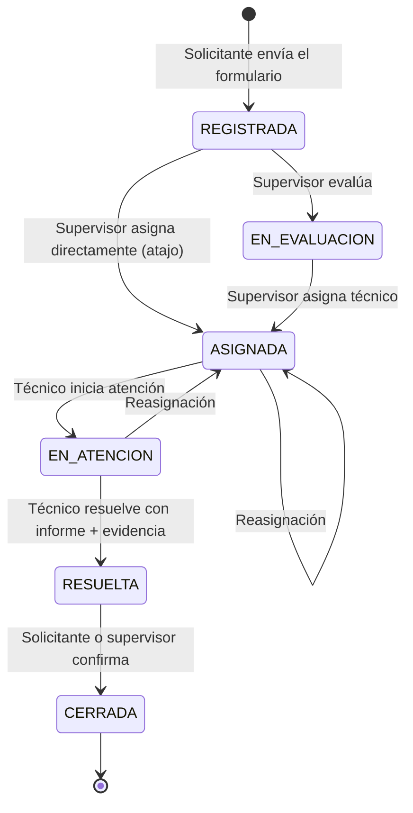
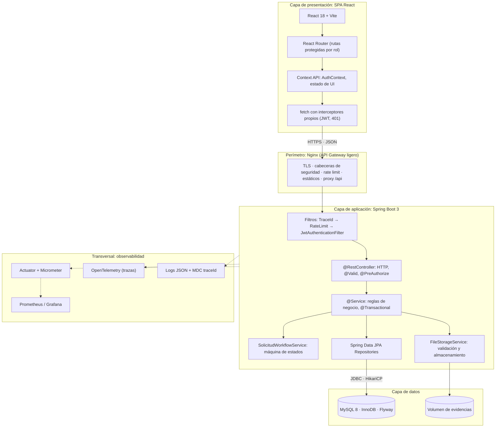
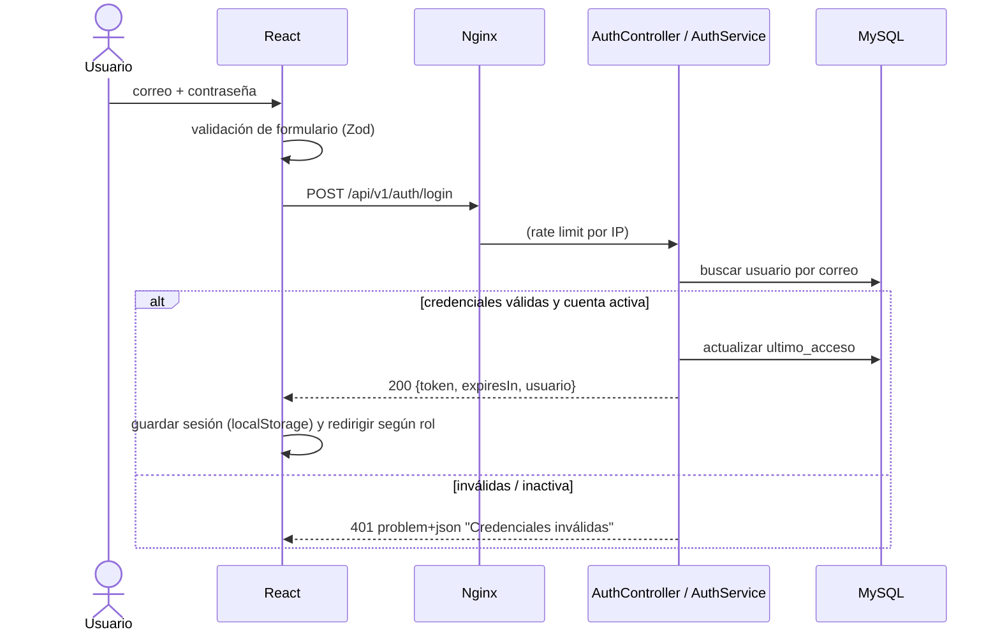
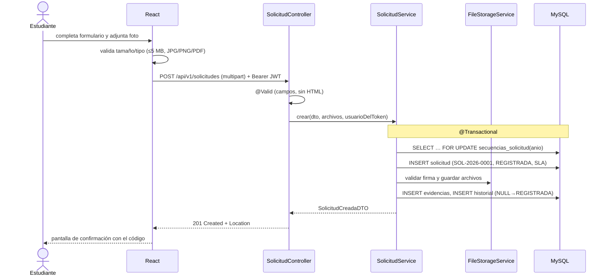
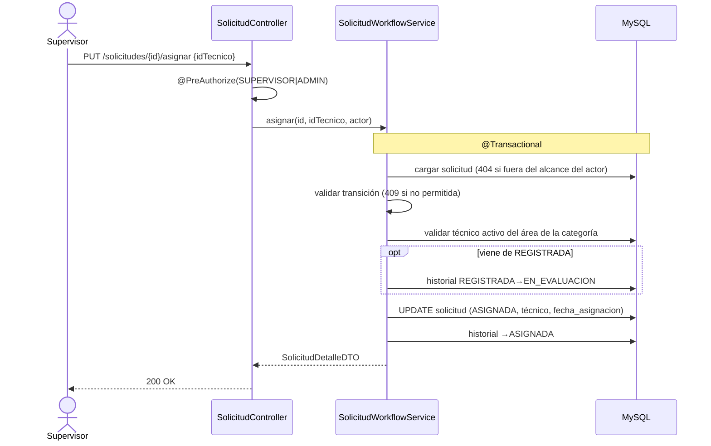
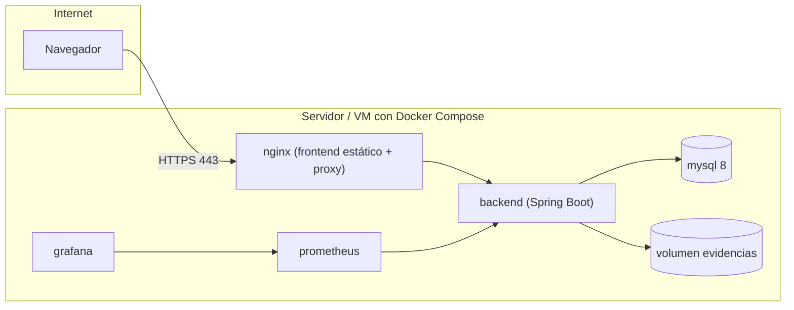

# Arquitectura Técnica

> **Visión:** sistema multicapa, desacoplado y *stateless*, con alta cohesión, bajo acoplamiento e integridad transaccional estricta, desplegable con un solo comando en cualquier ambiente.
> **Documentos relacionados:** [SRS](../01-definicion/especificaciones-tecnicas.md) · [Modelo de datos](modelo-datos.md) · [API REST](api-rest.md) · [Seguridad](../03-calidad-y-operacion/seguridad-owasp.md) · [DevOps](../03-calidad-y-operacion/devops-despliegue.md) · [Observabilidad](../03-calidad-y-operacion/observabilidad.md) · [ADRs](decisiones-arquitectura.md)

---

## 1. Visión y principios

| Principio | Qué significa aquí |
|:---|:---|
| **Separación de responsabilidades** | Presentación (React) / Aplicación (Spring Boot) / Datos (MySQL), cada una desplegable por separado. |
| **Backend stateless** | Sin sesión de servidor; la identidad viaja en un JWT. Permite réplicas detrás de un balanceador (RNF-03). |
| **Reglas de negocio en el servidor** | El frontend valida para dar buena experiencia, pero **toda** regla se vuelve a validar en el backend (el cliente no es de confianza). |
| **Transaccionalidad** | Alta, transición e historial ocurren en una sola transacción ACID (RNF-04). |
| **Seguridad por defecto** | Todo endpoint exige autenticación salvo una lista blanca explícita; autorización por rol **y** por propiedad del recurso. |
| **Configuración externa** | Nada sensible ni dependiente del ambiente está en el código: se inyecta por variables de entorno (12-factor). |
| **Observable desde el día 1** | Cada petición lleva un `traceId` presente en logs, respuestas de error y trazas. |

### Stack tecnológico

| Capa | Tecnología | Versión objetivo |
|:---|:---|:---|
| Frontend | React + Vite, React Router, Recharts, Vitest + Testing Library | React 18, Node 20 |
| Backend | Spring Boot, Spring Security, Spring Data JPA, Bean Validation, springdoc-openapi, Flyway, Micrometer | Spring Boot 3, Java 17 |
| Base de datos | MySQL (InnoDB) | 8.0 |
| Proxy / gateway | Nginx (TLS, cabeceras, *rate limiting*, estáticos, proxy a `/api`) | estable |
| Contenedores | Docker, Docker Compose | — |
| CI/CD | GitHub Actions, GitHub Container Registry | — |
| Observabilidad | Actuator, Micrometer, OpenTelemetry, Prometheus, Grafana, Jaeger | — |

---

## 2. Máquina de estados de las solicitudes

### 2.1 Diagrama



### 2.2 Matriz de transiciones y permisos

El "atajo" desde `REGISTRADA` (asignar sin pulsar antes "Evaluar") existe para ahorrar clics al supervisor; el sistema **registra igualmente el paso por `EN_EVALUACION` en el historial** (dos filas, misma transacción), por lo que la auditoría es completa ([ADR-003](decisiones-arquitectura.md#adr-003--atajo-de-asignación-desde-registrada)).

| # | Desde | Hacia | Acción (endpoint) | Quién puede | Precondición / regla | RN |
|:-:|:---|:---|:---|:---|:---|:---:|
| T1 | *(ninguno)* | `REGISTRADA` | Registrar (`POST /solicitudes`) | Cualquier usuario autenticado | Datos válidos; el solicitante es el del token | RN-01, 15, 18 |
| T2 | `REGISTRADA` | `EN_EVALUACION` | Evaluar (`PUT …/evaluar`) | `SUPERVISOR` del área, `ADMIN` | Puede ajustar la prioridad (recalcula SLA) | RN-09, 23 |
| T3 | `REGISTRADA` / `EN_EVALUACION` | `ASIGNADA` | Asignar (`PUT …/asignar`) | `SUPERVISOR` del área, `ADMIN` | Técnico **activo** del **área de la categoría** | RN-07 |
| T6 | `ASIGNADA` / `EN_ATENCION` | `ASIGNADA` | Reasignar (`PUT …/asignar`) | `SUPERVISOR` del área, `ADMIN` | Nuevo técnico válido; la nota registra "de X a Y" | RN-07 |
| T7 | `ASIGNADA` | `EN_ATENCION` | Iniciar (`PUT …/iniciar-atencion`) | Técnico asignado, `ADMIN` | Solo el técnico asignado | — |
| T8 | `EN_ATENCION` | `RESUELTA` | Resolver (`PUT …/resolver`) | Técnico asignado, `ADMIN` | Informe ≥ 20 caracteres y ≥ 1 evidencia `SOLUCION` | RN-12 |
| T9 | `RESUELTA` | `CERRADA` | Cerrar (`PUT …/cerrar`) | Solicitante, `SUPERVISOR` del área, `ADMIN` | Nota opcional | — |

*(Los estados `RECHAZADA` y `CANCELADA` y las transiciones T4, T5 y T10 —rechazar, cancelar, reabrir— se retiraron del alcance el 03/10/2026; la numeración T se conserva.)*

Cualquier combinación no listada responde **HTTP 409 Conflict** (RN-06). Un rol sin permiso responde **403**; un recurso fuera de alcance responde **404** (RN-16).

### 2.3 Efectos secundarios de cada transición

| Transición | Campos que actualiza | Historial |
|:---|:---|:---|
| T1 | `codigo`, `fecha_registro`, `fecha_limite_sla`, evidencias iniciales | `NULL → REGISTRADA` |
| T2 | `id_prioridad` (si cambia) y `fecha_limite_sla` | `REGISTRADA → EN_EVALUACION` |
| T3 | `id_tecnico_asignado`, `id_supervisor_asignador`, `fecha_asignacion` | 1 fila (2 si viene de `REGISTRADA`) |
| T7 | `fecha_inicio_atencion` | `ASIGNADA → EN_ATENCION` |
| T8 | `informe_resolucion`, `fecha_resolucion`, evidencias `SOLUCION` | `EN_ATENCION → RESUELTA` con informe |
| T9 | `fecha_cierre` | `RESUELTA → CERRADA` |

---

## 3. Arquitectura por capas



### 3.1 Responsabilidades por capa

| Capa | Responsable de | **No** debe |
|:---|:---|:---|
| **Controller** | Enrutar HTTP, deserializar JSON, validar con `@Valid`, aplicar `@PreAuthorize`, mapear DTO ↔ servicio, devolver el código HTTP correcto. | Contener reglas de negocio ni acceder a repositorios. |
| **Service** | Reglas de negocio (RN-xx), orquestación y `@Transactional`, verificación de propiedad/alcance del recurso. | Conocer HTTP (`HttpServletRequest`, `ResponseEntity`). |
| **Workflow** | Validar y ejecutar transiciones (matriz §2.2), escribir historial. | Ser invocado fuera de un servicio transaccional. |
| **Repository** | Acceso a datos con consultas parametrizadas y proyecciones. | Contener lógica de negocio. |
| **DTO / Mapper** | Contratos de entrada/salida inmutables (`record`). | Exponer entidades JPA o `password_hash`. |

---

## 4. Estructura de código

### 4.1 Backend (paquetes por funcionalidad, capas dentro)

```
backend/src/main/java/edu/universidad/servicios/
├── config/            SecurityConfig, CorsConfig, OpenApiConfig, JacksonConfig, AsyncConfig
├── common/
│   ├── exception/     GlobalExceptionHandler (RFC 7807), DomainException, TransicionInvalidaException…
│   ├── security/      JwtService, JwtAuthenticationFilter, CurrentUser, AccessPolicy
│   ├── web/           TraceIdFilter, RateLimitFilter, PageResponse
│   └── validation/    @SinHtml, @DominioInstitucional, @PasswordSegura
├── auth/              AuthController, AuthService, dto/
├── usuario/           entity/, repository/, service/, controller/ (admin), dto/
├── catalogo/          Area, Categoria, Prioridad, EstadoSolicitud: entity/ repository/ service/ controller/ dto/
├── solicitud/         entity/, repository/, service/ (SolicitudService, SolicitudWorkflowService, CodigoSolicitudService),
│                      controller/, dto/, specification/ (filtros dinámicos)
├── evidencia/         FileStorageService, FileTypeValidator, EvidenciaController
├── comentario/        …
├── dashboard/         DashboardController, DashboardService, DashboardRepository, dto/
└── demo/              DemoDataSeeder (solo perfil `demo`)
backend/src/main/resources/
├── application.yml, application-{dev,test,prod,demo}.yml    (solo ${VARIABLES})
└── db/migration → enlaza a database/migrations (Flyway)
backend/src/test/java/…                                        (unit, integration, api)
```

### 4.2 Frontend (por *features*)

```
frontend/src/
├── app/               App.jsx, router.jsx, providers.jsx
├── components/        ui/ (Button, Input, Modal, Table, Toast, EstadoBadge), layout/ (AppShell, ProtectedRoute, RoleRoute)
├── features/
│   ├── auth/          pages/, components/, AuthContext.jsx, schemas.js
│   ├── solicitudes/   pages/ (Nueva, Mis solicitudes, Detalle), components/ (FileUploader, Timeline), hooks/
│   ├── gestion/       pages/ (BandejaSupervisor, BandejaTecnico), components/ (ModalAsignacion, ModalResolucion)
│   ├── dashboard/     pages/, components/ (KpiCard, charts)
│   └── admin/         pages/, components/, hooks/useCrud.js
├── services/          apiClient.js (`fetch` con interceptores propios), *.api.js por recurso
├── styles/            tokens.css (variables), base.css, utilities.css
└── test/              setup, mocks
```

---

## 5. Almacenamiento de archivos

| Aspecto | Decisión |
|:---|:---|
| **Dónde** | Volumen Docker montado en `/var/app/evidencias`, **fuera** de cualquier directorio servido estáticamente. Los archivos **no** son accesibles por URL directa. |
| **Cómo se sirven** | Solo mediante `GET /api/v1/solicitudes/{id}/evidencias/{idEvidencia}` que verifica autenticación y alcance (RN-16) y responde con `Content-Disposition: attachment` y `X-Content-Type-Options: nosniff`. |
| **Nombre en disco** | `UUID.ext` aleatorio (`nombre_almacenado`); el nombre original solo se guarda como metadato. Evita *path traversal* y colisiones. |
| **Validación** | Extensión permitida **y** firma de archivo (*magic bytes*) coherente con JPG/PNG/PDF; tamaño ≤ 5 MB; máximo 3 por acción (RN-15). Se rechaza con 400/413/415. |
| **Consistencia** | Primero se escribe en disco y luego se registra en BD dentro de la transacción; si la transacción falla se elimina el archivo (compensación). |
| **Evolución** | La interfaz `FileStorageService` permite cambiar a S3/MinIO sin tocar la lógica de negocio. |

---

## 6. Flujos clave

### 6.1 Inicio de sesión



### 6.2 Registrar una solicitud con evidencia



### 6.3 Asignación por el supervisor (con atajo)



---

## 7. Patrones de diseño aplicados

| Patrón | Dónde | Por qué |
|:---|:---|:---|
| **Layered Architecture** | Controller → Service → Repository | Cohesión y bajo acoplamiento; pruebas por capa. |
| **DTO** (`record`) | Todas las respuestas/solicitudes de API | No exponer entidades ni campos sensibles; contrato estable. |
| **State / Strategy** | `SolicitudWorkflowService` con una tabla de transiciones permitidas (`Map<Estado, Set<Transicion>>`) | Evitar `if/else` dispersos; añadir una transición = una línea + test. |
| **Specification** | Filtros dinámicos de la bandeja (estado, prioridad, categoría, técnico, texto) | Combinar filtros sin explosión de métodos de repositorio. |
| **Repository** | Spring Data JPA | Abstracción de persistencia. |
| **Facade de seguridad** (`CurrentUser`, `AccessPolicy`) | Centraliza "¿puede este usuario ver/actuar sobre esta solicitud?" | Una sola implementación de RN-16 (evita IDOR por olvido en un endpoint). |
| **Global Exception Handler** (`@RestControllerAdvice`) | Toda la API | Errores uniformes RFC 7807 con `traceId`. |
| **Template/Compensation** | `FileStorageService` | Mantener consistencia disco–BD. |
| **Custom Hook** (`useCrud`, `useFetch`) | Frontend | Evitar duplicación en CRUD de administración y fetch con estado. |
| **Container / Presentational** | Frontend | Separar datos de presentación; componentes reutilizables y testeables. |

---

## 8. Manejo centralizado de errores

Todas las respuestas de error usan **RFC 7807 (`application/problem+json`)** con un campo adicional `traceId`:

```json
{
  "type": "https://servicios.universidad.edu/problemas/validacion",
  "title": "Validación fallida",
  "status": 400,
  "detail": "Uno o más campos no son válidos.",
  "instance": "/api/v1/auth/registro",
  "timestamp": "2026-10-03T15:04:05Z",
  "traceId": "4bf92f3577b34da6a3ce929d0e0e4736",
  "errores": { "correo": "Debe usar correo institucional (@universidad.edu)" }
}
```

| Excepción | HTTP | `type` (sufijo) |
|:---|:---:|:---|
| `MethodArgumentNotValidException`, `ConstraintViolationException`, JSON ilegible | 400 | `validacion` |
| `BadCredentialsException`, token ausente/ inválido/expirado | 401 | `no-autenticado` |
| `AccessDeniedException` | 403 | `prohibido` |
| `RecursoNoEncontradoException` (incluye fuera de alcance) | 404 | `no-encontrado` |
| `TransicionInvalidaException`, conflicto de unicidad | 409 | `conflicto` |
| `MaxUploadSizeExceededException` | 413 | `archivo-demasiado-grande` |
| Tipo de archivo no permitido | 415 | `tipo-no-soportado` |
| Rate limit excedido | 429 | `demasiadas-peticiones` |
| Cualquier otra (no controlada) | 500 | `error-interno` — mensaje genérico, **stacktrace solo en logs** con el mismo `traceId` |

El `traceId` se devuelve también en la cabecera `X-Trace-Id` y permite a soporte encontrar el log exacto ([Observabilidad §3](../03-calidad-y-operacion/observabilidad.md#3-logs-estructurados)).

---

## 9. Seguridad (resumen)

Detalle completo, matriz OWASP Top 10 y gestión de secretos en [Seguridad y OWASP](../03-calidad-y-operacion/seguridad-owasp.md). Resumen de la arquitectura:

- **Autenticación:** JWT HS256 con secreto ≥ 256 bits desde variable de entorno; 8 h de vida; sin *refresh token* ([ADR-004](decisiones-arquitectura.md#adr-004--jwt-de-8-horas-sin-refresh-token)).
- **Autorización en tres niveles:** (1) ruta autenticada, (2) `@PreAuthorize` por rol, (3) `AccessPolicy` por propiedad/área del recurso.
- **Contraseñas:** BCrypt coste 12; política RN-03; *rate limit* de login por IP en Nginx.
- **Transporte:** HTTPS terminado en Nginx; HSTS; CORS restringido a `ALLOWED_ORIGINS`.
- **Cabeceras:** CSP, `X-Content-Type-Options`, `X-Frame-Options`/`frame-ancestors`, `Referrer-Policy`, `Permissions-Policy`.
- **Entradas:** Bean Validation + rechazo de HTML (RN-18); consultas JPA parametrizadas.

---

## 10. Observabilidad (resumen)

Detalle en [Observabilidad](../03-calidad-y-operacion/observabilidad.md).

| Pilar | Implementación |
|:---|:---|
| **Logs** | JSON a stdout con `traceId`, `spanId`, `usuarioId` (nunca contraseñas/tokens). |
| **Métricas** | `/actuator/prometheus`: HTTP (latencia por endpoint), JVM, HikariCP y métricas de negocio (solicitudes creadas, transiciones, vencidas). |
| **Trazas** | Micrometer Tracing + OpenTelemetry, exportador OTLP; propagación W3C `traceparent`. |
| **Salud** | `/actuator/health` (liveness/readiness) usado por Docker y por el balanceador. |
| **Alertas** | Reglas de Prometheus/Grafana sobre error 5xx, latencia P95, caída de instancia y BD. |

---

## 11. Despliegue y ambientes



| Ambiente | Propósito | Perfil Spring | Origen del despliegue |
|:---|:---|:---:|:---|
| **dev** | Desarrollo local de cada integrante | `dev` | `docker compose up` local |
| **test / staging** | Integración, DAST y pruebas de aceptación | `test` | Despliegue automático al fusionar en `develop` |
| **prod / demo** | Producción de la sustentación | `prod` | Despliegue manual aprobado al crear un tag `v*` desde `main` |

Detalle de variables, *pipelines* y plataforma cloud en [DevOps y Despliegue](../03-calidad-y-operacion/devops-despliegue.md).

---

## 12. Atributos de calidad y cómo la arquitectura los cumple

| Atributo | Táctica arquitectónica |
|:---|:---|
| Escalabilidad (RNF-03) | Backend *stateless*; BD externa al contenedor; réplicas detrás de Nginx. |
| Rendimiento (RNF-02, 12) | Índices diseñados para consultas reales; agregaciones en SQL; paginación obligatoria; HikariCP; proyecciones DTO. |
| Seguridad (RNF-01) | Defensa en profundidad: Nginx → filtros → `@PreAuthorize` → `AccessPolicy` → BD con restricciones. |
| Integridad (RNF-04) | `@Transactional`, restricciones FK/CHECK, triggers de inmutabilidad. |
| Mantenibilidad (RNF-08) | Paquetes por funcionalidad, DTOs, workflow declarativo, cobertura mínima. |
| Disponibilidad (RNF-07) | *Healthchecks*, `restart: unless-stopped`, arranque ordenado `depends_on: condition: service_healthy`. |
| Observabilidad (RNF-06) | `traceId` extremo a extremo, métricas y alertas. |
