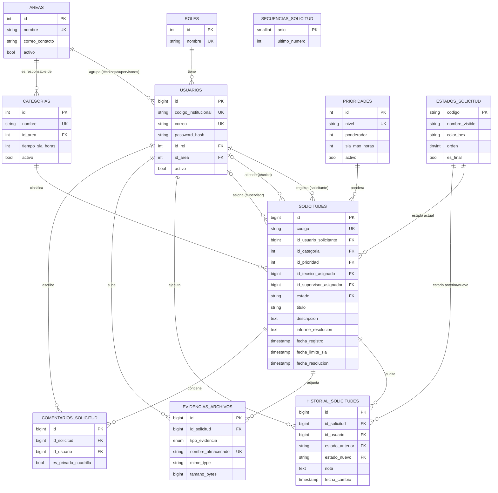

# Modelo de Datos Relacional (MySQL 8.0)

> **Motor:** MySQL 8.0+ · InnoDB · `utf8mb4` / `utf8mb4_unicode_ci`
> **Persistencia:** Spring Data JPA + Hibernate · migraciones con Flyway
> **Fuente única del esquema físico:** [`database/migrations/V1__esquema_inicial.sql`](../../database/migrations/V1__esquema_inicial.sql) y [`V2__datos_maestros.sql`](../../database/migrations/V2__datos_maestros.sql).
> Este documento **explica** el modelo (qué es cada tabla y por qué); **no duplica el DDL** para que no se desincronice ([ADR-010](decisiones-arquitectura.md#adr-010--fuente-única-de-verdad-por-tema)).

---

## 1. Principios de diseño

| Principio | Aplicación |
|:---|:---|
| **Normalización (3FN)** | Catálogos separados (roles, áreas, categorías, prioridades, estados); sin datos repetidos en `solicitudes`. |
| **Integridad referencial** | Todas las relaciones tienen `FOREIGN KEY`. Ninguna es `ON DELETE CASCADE`: los datos de negocio no se borran. |
| **Baja lógica (RN-14)** | `usuarios`, `areas`, `categorias`, `prioridades` usan `activo`. Borrar rompería historial y solicitudes pasadas. |
| **Auditoría inmutable (RN-17)** | `historial_solicitudes` tiene triggers que bloquean `UPDATE` y `DELETE`. |
| **Tiempos en UTC** | Todas las columnas `TIMESTAMP` guardan UTC; el frontend muestra en `America/Lima`. |
| **Restricciones en BD** | `CHECK` para SLA > 0 y color hexadecimal; `UNIQUE` para código, correo, nombres de catálogo. |
| **Rendimiento orientado a consultas reales** | Índices compuestos diseñados para la bandeja y para las agregaciones del dashboard (§5). |
| **Secretos fuera de la BD de negocio** | Solo se guarda el hash `password_hash` (BCrypt 12). |

---

## 2. Diagrama Entidad-Relación



> `SECUENCIAS_SOLICITUD` no se relaciona por FK: el backend la usa solo para generar el correlativo del código (RN-01).

---

## 3. Diccionario de datos

Leyenda: **PK** clave primaria · **FK** clave foránea · **UK** única · **IDX** indexada · "Nulo" indica si admite `NULL`.

### 3.1 `roles`
Roles de seguridad para RBAC. Los nombres llevan prefijo `ROLE_` (convención de Spring Security: `hasRole('SUPERVISOR')` busca `ROLE_SUPERVISOR`).

| Campo | Tipo | Nulo | Clave | Descripción y reglas |
|:---|:---|:---:|:---:|:---|
| `id` | INT AI | NO | PK | Identificador. |
| `nombre` | VARCHAR(30) | NO | UK | `ROLE_ESTUDIANTE`, `ROLE_TECNICO`, `ROLE_SUPERVISOR`, `ROLE_ADMIN`. |
| `descripcion` | VARCHAR(150) | SÍ | — | Descripción funcional. |

### 3.2 `areas`
Dependencias que prestan los servicios (TI, Mantenimiento, Servicios Generales…).

| Campo | Tipo | Nulo | Clave | Descripción y reglas |
|:---|:---|:---:|:---:|:---|
| `id` | INT AI | NO | PK | Identificador. |
| `nombre` | VARCHAR(100) | NO | UK | Nombre del área. |
| `correo_contacto` | VARCHAR(100) | NO | — | Correo de la jefatura. |
| `activo` | BOOLEAN | NO | — | Baja lógica (default `TRUE`). |

### 3.3 `usuarios`

| Campo | Tipo | Nulo | Clave | Descripción y reglas |
|:---|:---|:---:|:---:|:---|
| `id` | BIGINT AI | NO | PK | Identificador. |
| `codigo_institucional` | VARCHAR(20) | NO | UK | Código de alumno o empleado (ej. `U20261045`). **Se solicita en el registro** (RF-02). |
| `nombre` / `apellido` | VARCHAR(60) | NO | — | Nombres y apellidos. |
| `correo` | VARCHAR(100) | NO | UK | Correo institucional, guardado en minúsculas (RN-02). |
| `password_hash` | VARCHAR(255) | NO | — | BCrypt coste 12. Nunca se expone en DTO ni logs. |
| `telefono` | VARCHAR(20) | SÍ | — | Contacto opcional. |
| `id_rol` | INT | NO | FK→`roles` | Rol único del usuario. |
| `id_area` | INT | SÍ | FK→`areas` | Obligatoria para `TECNICO` y `SUPERVISOR`; `NULL` para el resto (RN-21, validada en el servicio). |
| `activo` | BOOLEAN | NO | — | Baja lógica; se verifica en cada petición (RN-22). |
| `ultimo_acceso` | TIMESTAMP | SÍ | — | Último login correcto. |
| `fecha_creacion` / `fecha_actualizacion` | TIMESTAMP | NO | — | Auditoría básica (la segunda se actualiza sola). |

**Índice:** `idx_usuarios_rol_area (id_rol, id_area, activo)` → listar técnicos activos de un área.

### 3.4 `categorias`
Tipos de servicio. Cada categoría pertenece a **un área**, que es quien la atiende (RN-07, RN-16).

| Campo | Tipo | Nulo | Clave | Descripción y reglas |
|:---|:---|:---:|:---:|:---|
| `id` | INT AI | NO | PK | Identificador. |
| `nombre` | VARCHAR(80) | NO | UK | Ej. `Redes y Wi-Fi`. |
| `descripcion` | VARCHAR(255) | SÍ | — | Qué cubre. |
| `id_area` | INT | NO | FK→`areas` | Área responsable. |
| `tiempo_sla_horas` | INT | NO | — | SLA estándar de la categoría (default 48; `CHECK > 0`). |
| `activo` | BOOLEAN | NO | — | Si es `FALSE`, no aparece en el formulario de nueva solicitud (RN-14). |

### 3.5 `prioridades`

| Campo | Tipo | Nulo | Clave | Descripción y reglas |
|:---|:---|:---:|:---:|:---|
| `id` | INT AI | NO | PK | Identificador. |
| `nivel` | VARCHAR(20) | NO | UK | `BAJA`, `MEDIA`, `ALTA`, `CRITICA`. |
| `ponderador` | INT | NO | — | Orden de urgencia (1 = menor, 4 = mayor). |
| `sla_max_horas` | INT | NO | — | SLA por prioridad: 72 / 48 / 24 / 4 (`CHECK > 0`). |
| `activo` | BOOLEAN | NO | — | Baja lógica. |

### 3.6 `estados_solicitud`
Catálogo de estados. **El `codigo` es parte del dominio** (la máquina de estados del backend depende de él), por eso no se puede crear ni borrar un estado desde la UI; el administrador solo edita la presentación (nombre visible, descripción, color). Ver [ADR-009](decisiones-arquitectura.md#adr-009--los-estados-son-un-catálogo-de-presentación-no-de-comportamiento).

| Campo | Tipo | Nulo | Clave | Descripción y reglas |
|:---|:---|:---:|:---:|:---|
| `codigo` | VARCHAR(20) | NO | PK | `REGISTRADA`, `EN_EVALUACION`, `ASIGNADA`, `EN_ATENCION`, `RESUELTA`, `CERRADA`. |
| `nombre_visible` | VARCHAR(40) | NO | — | Texto mostrado en la UI (editable). |
| `descripcion` | VARCHAR(255) | SÍ | — | Ayuda contextual (editable). |
| `color_hex` | CHAR(7) | NO | — | Color de la etiqueta, formato `#RRGGBB` (`CHECK` con REGEXP). |
| `orden` | TINYINT | NO | — | Orden de presentación. |
| `es_final` | BOOLEAN | NO | — | `TRUE` solo en `CERRADA` (no admite más transiciones ni comentarios). |

### 3.7 `secuencias_solicitud`
Una fila por año con el último número usado. El alta de solicitud hace `SELECT … FOR UPDATE` sobre la fila del año, incrementa y construye el código **dentro de la misma transacción** (RN-01), evitando duplicados bajo concurrencia.

| Campo | Tipo | Nulo | Clave | Descripción |
|:---|:---|:---:|:---:|:---|
| `anio` | SMALLINT | NO | PK | Año (ej. 2026). Se crea la fila al primer alta del año. |
| `ultimo_numero` | INT | NO | — | Último correlativo emitido. |

### 3.8 `solicitudes`
Entidad central.

| Campo | Tipo | Nulo | Clave | Descripción y reglas |
|:---|:---|:---:|:---:|:---|
| `id` | BIGINT AI | NO | PK | Id técnico, usado en las rutas de la API (`/solicitudes/{id}`). |
| `codigo` | VARCHAR(30) | NO | UK | `SOL-AAAA-NNNN` (RN-01). Es el identificador **visible** para las personas. |
| `id_usuario_solicitante` | BIGINT | NO | FK→`usuarios` | Siempre el usuario del JWT (nunca viene del cliente). |
| `id_categoria` | INT | NO | FK→`categorias` | Determina el **área responsable**. |
| `id_prioridad` | INT | NO | FK→`prioridades` | Propuesta por el solicitante; definitiva tras la evaluación (RN-23). |
| `id_tecnico_asignado` | BIGINT | SÍ | FK→`usuarios` | Técnico responsable. |
| `id_supervisor_asignador` | BIGINT | SÍ | FK→`usuarios` | Supervisor que asignó. |
| `titulo` | VARCHAR(150) | NO | — | Resumen (≥ 5 caracteres). |
| `descripcion` | TEXT | NO | — | 15–500 caracteres, sin HTML (RN-18). |
| `ubicacion_campus` | VARCHAR(100) | NO | — | Sede/campus. |
| `ubicacion_ambiente` | VARCHAR(100) | NO | — | Pabellón/aula/laboratorio. |
| `estado` | VARCHAR(20) | NO | FK→`estados_solicitud` | Estado actual (default `REGISTRADA`). |
| `informe_resolucion` | TEXT | SÍ | — | Informe técnico al resolver (RN-12). |
| `fecha_registro` | TIMESTAMP | NO | — | Alta (UTC). |
| `fecha_limite_sla` | TIMESTAMP | SÍ | IDX | Vencimiento calculado (RN-09). |
| `fecha_asignacion` | TIMESTAMP | SÍ | — | Cuándo pasó a `ASIGNADA`. |
| `fecha_inicio_atencion` | TIMESTAMP | SÍ | — | Cuándo pasó a `EN_ATENCION`. |
| `fecha_resolucion` | TIMESTAMP | SÍ | — | Cuándo pasó a `RESUELTA`. Base del MTTR. |
| `fecha_cierre` | TIMESTAMP | SÍ | — | Cuándo pasó a `CERRADA`. |

### 3.9 `historial_solicitudes`
Bitácora de cambios de estado. **Inmutable**: sus triggers `trg_historial_no_update` y `trg_historial_no_delete` lanzan `SQLSTATE 45000`.

| Campo | Tipo | Nulo | Clave | Descripción y reglas |
|:---|:---|:---:|:---:|:---|
| `id` | BIGINT AI | NO | PK | Identificador. |
| `id_solicitud` | BIGINT | NO | FK | Solicitud afectada. |
| `id_usuario` | BIGINT | NO | FK | Actor que ejecutó el cambio. |
| `estado_anterior` | VARCHAR(20) | **SÍ** | FK | `NULL` en la fila de creación (no había estado previo). |
| `estado_nuevo` | VARCHAR(20) | NO | FK | Estado resultante. |
| `nota` | TEXT | SÍ | — | Informe de resolución o nota del actor. |
| `fecha_cambio` | TIMESTAMP | NO | — | Momento del cambio (UTC). |

### 3.10 `evidencias_archivos`
Solo **metadatos**; el binario vive en el almacenamiento de archivos (volumen), nunca en la BD.

| Campo | Tipo | Nulo | Clave | Descripción y reglas |
|:---|:---|:---:|:---:|:---|
| `id` | BIGINT AI | NO | PK | Identificador. |
| `id_solicitud` | BIGINT | NO | FK | Solicitud a la que pertenece. |
| `id_usuario_subio` | BIGINT | NO | FK | Quién cargó el archivo. |
| `tipo_evidencia` | ENUM | NO | — | `INICIAL` (reporte) o `SOLUCION` (reparación). |
| `nombre_original` | VARCHAR(255) | NO | — | Nombre que el usuario subió (solo informativo; se sanea al mostrar). |
| `nombre_almacenado` | VARCHAR(100) | NO | UK | Nombre aleatorio (UUID + extensión) con el que se guarda; evita *path traversal* y colisiones. |
| `ruta_almacenamiento` | VARCHAR(500) | NO | — | Ruta relativa dentro del almacenamiento. |
| `mime_type` | VARCHAR(100) | NO | — | Tipo **detectado por contenido** (RN-15). |
| `tamano_bytes` | BIGINT | NO | — | > 0 y ≤ 5 242 880. |
| `fecha_subida` | TIMESTAMP | NO | — | Fecha de carga. |

### 3.11 `comentarios_solicitud`

| Campo | Tipo | Nulo | Clave | Descripción y reglas |
|:---|:---|:---:|:---:|:---|
| `id` | BIGINT AI | NO | PK | Identificador. |
| `id_solicitud` | BIGINT | NO | FK | Solicitud comentada. |
| `id_usuario` | BIGINT | NO | FK | Autor. |
| `comentario` | TEXT | NO | — | 1–500 caracteres, sin HTML. |
| `es_privado_cuadrilla` | BOOLEAN | NO | — | Si es `TRUE`, solo lo ven técnico, supervisor y admin (RN-19). |
| `fecha_comentario` | TIMESTAMP | NO | — | Fecha. |

---

## 4. Datos maestros iniciales (`V2__datos_maestros.sql`)

| Tabla | Contenido sembrado |
|:---|:---|
| `roles` | Los 4 roles. |
| `prioridades` | `BAJA` 72 h · `MEDIA` 48 h · `ALTA` 24 h · `CRITICA` 4 h. |
| `estados_solicitud` | Los 6 estados con nombre visible, color y orden. |
| `areas` | Tecnologías de la Información · Mantenimiento e Infraestructura · Servicios Generales. |
| `categorias` | Soporte de Software, Redes y Wi-Fi, Equipos de Cómputo (TI); Electricidad, Mobiliario (Mantenimiento); Limpieza e Higiene (Servicios Generales). |

**Por qué se siembran:** sin categorías, áreas y prioridades no se puede registrar ninguna solicitud, y el CRUD de administración llega después del MVP. Así el flujo MVP funciona desde el primer día.

**Usuarios de demostración:** **no** están en SQL. Se crean con un `DemoDataSeeder` (perfil Spring `demo`) usando el `PasswordEncoder` y contraseñas tomadas de variables de entorno, para no versionar hashes ni credenciales ([Seguridad §6](../03-calidad-y-operacion/seguridad-owasp.md#6-gestión-de-secretos)). Usuarios previstos: 1 admin, 1 supervisor y 1 técnico por área, y 3 estudiantes.

---

## 5. Estrategia de índices

| Índice | Consulta que acelera |
|:---|:---|
| `idx_solicitudes_estado_fecha (estado, fecha_registro)` | Bandeja filtrada por estado y ordenada por fecha; conteos de pendientes. |
| `idx_solicitudes_solicitante (id_usuario_solicitante, fecha_registro)` | "Mis solicitudes". |
| `idx_solicitudes_tecnico_estado (id_tecnico_asignado, estado)` | Bandeja del técnico; dashboard por responsable. |
| `idx_solicitudes_categoria (id_categoria, estado)` | Distribución por categoría y filtro por área (JOIN a `categorias`). |
| `idx_solicitudes_prioridad (id_prioridad, estado)` | Distribución por prioridad. |
| `idx_solicitudes_limite_sla (fecha_limite_sla)` | Solicitudes vencidas. |
| `idx_historial_solicitud_fecha (id_solicitud, fecha_cambio)` | Línea de tiempo de una solicitud. |
| `idx_comentarios_solicitud`, `idx_evidencias_solicitud` | Detalle de solicitud. |
| `idx_usuarios_rol_area`, `idx_categorias_area` | Listados de técnicos y categorías por área. |


---

## 6. Consultas de referencia (dashboard)

Se muestran como contrato de lo que el backend debe calcular (JPQL/SQL nativo con parámetros; **nunca** concatenación). `:idArea`, `:idTecnico`, `:desde` y `:hasta` son opcionales y los inyecta el servicio según el rol (RN-16).

```sql
-- Pendientes (RN-11)
SELECT COUNT(*) FROM solicitudes s JOIN categorias c ON c.id = s.id_categoria
WHERE s.estado IN ('REGISTRADA','EN_EVALUACION','ASIGNADA','EN_ATENCION')
  AND (:idArea IS NULL OR c.id_area = :idArea)
  AND (:idTecnico IS NULL OR s.id_tecnico_asignado = :idTecnico)
  AND s.fecha_registro BETWEEN :desde AND :hasta;

-- MTTR en horas (RN-11)
SELECT AVG(TIMESTAMPDIFF(MINUTE, s.fecha_registro, s.fecha_resolucion)) / 60.0
FROM solicitudes s JOIN categorias c ON c.id = s.id_categoria
WHERE s.fecha_resolucion IS NOT NULL
  AND (:idArea IS NULL OR c.id_area = :idArea);

-- Vencidas (RN-10)
SELECT COUNT(*) FROM solicitudes s JOIN categorias c ON c.id = s.id_categoria
WHERE s.estado IN ('REGISTRADA','EN_EVALUACION','ASIGNADA','EN_ATENCION')
  AND s.fecha_limite_sla < UTC_TIMESTAMP()
  AND (:idArea IS NULL OR c.id_area = :idArea);

-- Por responsable
SELECT CONCAT(u.nombre,' ',u.apellido) AS nombre, COUNT(*) AS valor
FROM solicitudes s JOIN usuarios u ON u.id = s.id_tecnico_asignado
JOIN categorias c ON c.id = s.id_categoria
WHERE (:idArea IS NULL OR c.id_area = :idArea)
GROUP BY u.id, u.nombre, u.apellido;
```

---

## 7. Evolución del esquema

- Cada cambio es una **nueva migración** `V<n>__descripcion.sql`; nunca se edita una migración ya aplicada.
- Hibernate trabaja con `ddl-auto=validate`: si la entidad no coincide con el esquema, la aplicación falla al arrancar (detecta desvíos pronto). Nunca `update` ni `create`.
- Los cambios pasan por PR con revisión del Rol 3 (DBA).

### Diferencias respecto a la versión 1.0 de este documento

| Cambio | Motivo |
|:---|:---|
| De 9 a **11 tablas** (+`estados_solicitud`, `secuencias_solicitud`) | Cubrir administración de estados y código correlativo seguro. |
| `solicitudes.estado`: de `ENUM` a `VARCHAR` con FK al catálogo | Permitir editar la presentación sin cambiar el esquema ([ADR-009](decisiones-arquitectura.md#adr-009--los-estados-son-un-catálogo-de-presentación-no-de-comportamiento)). |
| `ON DELETE CASCADE` → sin cascada | Coherente con baja lógica e historial inmutable. |
| `historial.estado_anterior` admite `NULL` | Representar la creación de la solicitud. |
| Se agregan `informe_resolucion`, `fecha_asignacion`, `fecha_inicio_atencion` | Necesarios para RN-12 y el SLA operativo. |
| `usuarios`: `ultimo_acceso` | Auditoría. |
| `evidencias`: `nombre_original` + `nombre_almacenado` | Evitar *path traversal* (OWASP A01/A03). |
| `activo` en `prioridades` | Cumplir baja lógica generalizada. |
