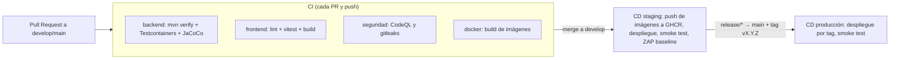

# DevOps, Contenedores, CI/CD y Despliegue

> **Objetivo (TS-01, TS-02, TS-03):** que el sistema se empaquete, pruebe y despliegue de forma automatizada, reproducible y segura, con ambientes separados.
> Relacionados: [Arquitectura §11](../02-diseno/arquitectura-tecnica.md#11-despliegue-y-ambientes) · [Seguridad §6](seguridad-owasp.md#6-gestión-de-secretos) · [Gobernanza Git](../04-gestion/equipo-y-flujo-de-trabajo.md) · [ADR-007](../02-diseno/decisiones-arquitectura.md#adr-007--plataforma-de-despliegue) · [Observabilidad](observabilidad.md)

---

## 1. Visión

| Principio | Aplicación |
|:---|:---|
| **Todo reproducible con un comando** | `docker compose up --build` levanta frontend, backend, BD y (opcional) monitoreo en una máquina limpia (RNF-09). |
| **Una imagen, varios ambientes** | La misma imagen de cada servicio se promociona de *staging* a *producción*; solo cambia la configuración (variables de entorno). |
| **Infraestructura como código** | Dockerfiles, `docker-compose*.yml`, configuración de Nginx y pipelines viven en el repositorio. |
| **Configuración por entorno, no por código** | 12-factor: ver §5. |
| **Despliegue automatizado y reversible** | Despliegue sin pasos manuales ocultos; *rollback* = redesplegar el *tag* anterior. |

---

## 2. Contenedores

### 2.1 Servicios

| Servicio | Imagen base | Puerto interno | Contenido y reglas |
|:---|:---|:---:|:---|
| **frontend** (Nginx) | *Multi-stage:* `node:20-alpine` compila → `nginx:stable-alpine` sirve | 80 (443 en prod) | Sirve la SPA y hace de **API Gateway**: proxy `/api/` → `backend:8080`, cabeceras de seguridad, *rate limit*, TLS. `VITE_API_URL=/api/v1` se fija en *build*. |
| **backend** | *Multi-stage:* `maven:3-eclipse-temurin-17` compila → `eclipse-temurin:17-jre` ejecuta | 8080 | JAR en capas (dependencias cacheadas); usuario **no root**; `HEALTHCHECK` a `/actuator/health`; `-Duser.timezone=UTC`; volumen `evidencias`. |
| **db** | `mysql:8.0` | 3306 (**no** publicado al host en prod) | Volumen `mysql_data`; `utf8mb4`; usuario de aplicación sin privilegios DDL en prod; el esquema lo aplica **Flyway** desde el backend. |
| **prometheus** *(perfil `monitoring`)* | `prom/prometheus` | 9090 | Scrapea `backend:8080/actuator/prometheus`; reglas de alerta. |
| **grafana** *(perfil `monitoring`)* | `grafana/grafana` | 3000 | Dashboards y alertas provisionados desde archivos. |
| **jaeger** *(perfil `monitoring`)* | `jaegertracing/all-in-one` | 16686 (UI) · 4318 (OTLP) | Visor de trazas. |

### 2.2 Estructura de archivos de contenedores (objetivo)

```
/
├── docker-compose.yml              base: db + backend + frontend
├── docker-compose.dev.yml          override dev: puertos abiertos, hot reload
├── docker-compose.monitoring.yml   prometheus + grafana + jaeger
├── docker-compose.prod.yml         override prod: sin puertos de BD, TLS, límites de recursos
├── .env.example                    plantilla de variables (sin secretos reales)
├── backend/Dockerfile
├── frontend/Dockerfile
├── frontend/nginx/                 default.conf (proxy, cabeceras, rate limit), snippets
└── ops/
    ├── prometheus/ (prometheus.yml, alert-rules.yml)
    └── grafana/    (provisioning, dashboards/*.json)
```

### 2.3 Esqueleto de `docker-compose.yml` (contrato a implementar en TASK-015)

```yaml
services:
  db:
    image: mysql:8.0
    restart: unless-stopped
    environment:
      MYSQL_DATABASE: ${DB_NAME}
      MYSQL_USER: ${DB_USER}
      MYSQL_PASSWORD: ${DB_PASSWORD}
      MYSQL_ROOT_PASSWORD: ${DB_ROOT_PASSWORD}
    command: ["--character-set-server=utf8mb4", "--collation-server=utf8mb4_unicode_ci"]
    volumes: [ "mysql_data:/var/lib/mysql" ]
    healthcheck:
      test: ["CMD", "mysqladmin", "ping", "-h", "localhost", "-p${DB_ROOT_PASSWORD}"]
      interval: 10s
      timeout: 5s
      retries: 10

  backend:
    build: ./backend
    restart: unless-stopped
    depends_on:
      db: { condition: service_healthy }
    environment:
      SPRING_PROFILES_ACTIVE: ${SPRING_PROFILES_ACTIVE:-dev}
      DB_HOST: db
      DB_PORT: 3306
      DB_NAME: ${DB_NAME}
      DB_USER: ${DB_USER}
      DB_PASSWORD: ${DB_PASSWORD}
      JWT_SECRET: ${JWT_SECRET}
      ALLOWED_ORIGINS: ${ALLOWED_ORIGINS}
      ALLOWED_EMAIL_DOMAIN: ${ALLOWED_EMAIL_DOMAIN}
      STORAGE_PATH: /var/app/evidencias
    volumes: [ "evidencias:/var/app/evidencias" ]
    healthcheck:
      test: ["CMD", "wget", "-qO-", "http://localhost:8080/actuator/health"]
      interval: 15s
      timeout: 5s
      retries: 5

  frontend:
    build:
      context: ./frontend
      args: { VITE_API_URL: /api/v1 }
    restart: unless-stopped
    depends_on:
      backend: { condition: service_healthy }
    ports: [ "80:80" ]

volumes:
  mysql_data:
  evidencias:
```

> Esta sección es **especificación**: las variables vienen del `.env` (no se escriben valores en el YAML) y `db` no publica el puerto 3306. La implementación y su verificación son parte de TASK-015.

### 2.4 Buenas prácticas de imágenes

- Versiones de imagen fijadas (no `latest`).
- `.dockerignore` para no copiar `.git`, `node_modules`, `.env`, `target/`.
- Una sola responsabilidad por contenedor; logs a *stdout/stderr*.
- Límites de memoria/CPU en `prod`; `read_only` y `no-new-privileges` donde sea posible.

---

## 3. Ambientes

| Ambiente | Propósito | Rama / disparador | Datos | Perfil Spring | Observaciones |
|:---|:---|:---|:---|:---:|:---|
| **dev** | Desarrollo local | cualquier rama (máquina de cada integrante) | Datos maestros + `demo` | `dev` | Puertos abiertos, Swagger activo, logs legibles |
| **test** (staging) | Integración, DAST, pruebas de aceptación | `push` a `develop` → despliegue automático | Datos maestros + `demo` | `test` | Réplica de producción; Swagger activo; sin datos reales |
| **prod** (demo final) | Sustentación y uso real | *tag* `v*` desde `main` | Datos maestros + seed de demostración controlado | `prod` | Swagger **desactivado**, errores sin detalle, TLS, monitoreo activo |

Cada ambiente tiene su **propio `.env`**, sus **propios secretos** (distintos entre sí) y su propia BD. En CI, los secretos se definen por *GitHub Environment*.

---

## 4. Pipeline CI/CD (GitHub Actions)

### 4.1 Visión



### 4.2 Jobs del pipeline objetivo

| Workflow | Disparador | Jobs | Criterio de éxito |
|:---|:---|:---|:---|
| **`ci.yml`** | `pull_request` y `push` a `develop`/`main` | `backend` (JDK 17, `mvn -B verify`, JaCoCo con umbral **≥ 70 %**, publica reporte) · `frontend` (Node 20, `npm ci`, `lint`, `vitest run --coverage`, `build`) · `docker-build` (construye sin publicar) | Todos verdes |
| **`security.yml`** | PR, `push` y programado (semanal) | `codeql` (java, javascript) · `gitleaks` (Dependabot cubre las dependencias) | 0 hallazgos altos/críticos sin justificar |
| **`cd-staging.yml`** | `push` a `develop` (tras CI verde) | Construye y publica imágenes en **GHCR** con *tag* `sha-<commit>`; se conecta al servidor *staging*; `docker compose pull && up -d`; *smoke test* `GET /actuator/health` y login de prueba; **ZAP baseline** | Smoke OK; 0 alertas ZAP altas |
| **`cd-prod.yml`** | `push` de *tag* `v*` | Despliega las imágenes del *tag* `vX.Y.Z` con las variables del *Environment* `production`; *smoke test* | Smoke OK |

Reglas comunes: acciones fijadas por versión; permisos mínimos (`permissions: contents: read`); secretos solo del *Environment*; `concurrency` para evitar despliegues simultáneos; caché de Maven/npm.

### 4.3 Versionado y releases

- **SemVer:** `v0.5.0-mvp` (Hito 1, 17/10), `v0.9.0-rc.1` (Release Candidate), `v1.0.0` (sustentación).
- Cada *release* genera notas automáticas (Conventional Commits) y adjunta: `openapi.yaml`, informe de cobertura, informe SAST/DAST.
- **Rollback:** redesplegar el *tag* anterior (`docker compose` con la versión previa); las migraciones de BD son **aditivas**, y los cambios destructivos se hacen en dos pasos (expandir → contraer) para que el rollback de código siga siendo posible.

### 4.4 Estado actual del CI (diagnóstico y pendientes)

El archivo `.github/workflows/ci.yml` actual es un **esqueleto** válido para empezar, pero tiene limitaciones que deben corregirse (tareas TASK-015, 028 y 029):

| # | Hallazgo | Riesgo | Corrección prevista |
|:-:|:---|:---|:---|
| 1 | Si no existen `backend/` o `frontend/` el job **termina en verde sin ejecutar nada** | *Falso verde*: un PR podría pasar sin pruebas | Quitar la condición una vez inicializados los directorios; fallar si faltan |
| 2 | `setup-node` define `cache-dependency-path` pero **no `cache: npm`** | La caché no se activa; builds más lentos | Añadir `cache: npm` |
| 3 | `npm test -- --watchAll=false` es una bandera de **Jest**; el proyecto usa **Vitest** (ADR-008) | Fallo o bandera ignorada | Script `test` = `vitest run`; sin banderas de Jest |
| 4 | No hay cobertura (JaCoCo/Vitest) | No se verifica el 70 % del escenario "Informe de pruebas" | Umbral en `pom.xml` y `vitest.config` |
| 5 | No hay SAST, escaneo de secretos ni de dependencias | Incumple Fase III/IV | Añadir `security.yml` |
| 6 | No se construyen imágenes Docker en CI | Un Dockerfile roto se descubre tarde | Job `docker-build` |
| 7 | No existe `cd.yml` (CD) pese a estar en las tareas | No hay despliegue automatizado | `cd-staging.yml` y `cd-prod.yml` |
| 8 | Dispara en `develop`, rama que aún no existe en el remoto | CI no corre en integración | Crear `develop` y protegerla ([Gobernanza §1](../04-gestion/equipo-y-flujo-de-trabajo.md)) |
| 9 | Sin `dependabot.yml` ni `CODEOWNERS` | Dependencias sin vigilar; revisiones sin responsable | Añadirlos |

---

## 5. Variables de entorno

Plantilla versionada en **`.env.example`**. Los valores reales **no** se versionan ([Seguridad §6](seguridad-owasp.md#6-gestión-de-secretos)). La aplicación falla al arrancar si falta una variable obligatoria.

| Variable | Servicio | ¿Secreto? | Obligatoria | Ejemplo / valor por defecto | Descripción |
|:---|:---|:---:|:---:|:---|:---|
| `SPRING_PROFILES_ACTIVE` | backend | No | Sí | `dev` / `test` / `prod` (+ `demo`) | Perfil de configuración |
| `TZ` | todos | No | No | `UTC` | Zona horaria del contenedor |
| `DB_HOST` · `DB_PORT` | backend | No | Sí | `db` · `3306` | Conexión a MySQL |
| `DB_NAME` | backend, db | No | Sí | `gestion_servicios_db` | Nombre de la BD |
| `DB_USER` | backend, db | No | Sí | `app_servicios` | Usuario de aplicación |
| `DB_PASSWORD` | backend, db | **Sí** | Sí | *(vacío en la plantilla)* | Contraseña del usuario de aplicación |
| `DB_ROOT_PASSWORD` | db | **Sí** | Sí | *(vacío en la plantilla)* | Contraseña root de MySQL (solo contenedor) |
| `FLYWAY_USER` · `FLYWAY_PASSWORD` | backend (prod) | **Sí** | Prod | *(vacío)* | Usuario con DDL para migraciones (separado del de aplicación) |
| `JWT_SECRET` | backend | **Sí** | Sí | *(≥ 32 bytes aleatorios; generar con `openssl rand -base64 48`)* | Clave de firma HS256 |
| `JWT_EXPIRATION_MINUTES` | backend | No | No | `480` | Vida del token (RNF-01/ADR-004) |
| `ALLOWED_ORIGINS` | backend | No | Sí | `https://servicios.ejemplo.edu` | Orígenes CORS permitidos |
| `ALLOWED_EMAIL_DOMAIN` | backend | No | No | `universidad.edu` | Dominio institucional del registro (RN-02) |
| `STORAGE_PATH` | backend | No | Sí | `/var/app/evidencias` | Directorio de evidencias |
| `MAX_FILE_SIZE_MB` | backend | No | No | `5` | Límite por archivo (RN-15) |
| `OTEL_SERVICE_NAME` | backend | No | No | `servicios-backend` | Nombre en trazas |
| `OTEL_EXPORTER_OTLP_ENDPOINT` | backend | No | No | `http://jaeger:4318` | Destino de trazas |
| `GRAFANA_ADMIN_PASSWORD` | grafana | **Sí** | Con monitoreo | *(vacío)* | Admin de Grafana |
| `DEMO_USER_PASSWORD` | backend (`demo`) | **Sí** | Con `demo` | *(vacío)* | Contraseña de los usuarios de demostración |
| `VITE_API_URL` | frontend (*build*) | No | Sí | `/api/v1` | URL base de la API (pública por naturaleza) |

**Reglas:** (1) nada de la tabla marcado **Sí** en "¿Secreto?" aparece en el repo, en imágenes ni en logs; (2) los valores de `prod` son distintos de `test` y `dev`; (3) en GitHub se guardan como *Secrets* del *Environment* correspondiente.

---

## 6. Fragmento de configuración de Nginx (contrato)

```nginx
# Zona de limitación para endpoints de autenticación
limit_req_zone $binary_remote_addr zone=auth:10m rate=10r/m;

server {
    listen 443 ssl http2;
    server_tokens off;
    client_max_body_size 16m;                # 3 archivos x 5 MB + margen

    # Cabeceras de seguridad (valores en seguridad-owasp.md §7)
    add_header Strict-Transport-Security "max-age=31536000; includeSubDomains" always;
    add_header X-Content-Type-Options "nosniff" always;
    add_header X-Frame-Options "DENY" always;
    add_header Referrer-Policy "strict-origin-when-cross-origin" always;
    add_header Content-Security-Policy "default-src 'self'; script-src 'self'; style-src 'self'; img-src 'self' data:; connect-src 'self'; frame-ancestors 'none'; base-uri 'self'; form-action 'self'" always;

    # SPA: cualquier ruta del cliente devuelve index.html
    location / { root /usr/share/nginx/html; try_files $uri /index.html; }

    # API Gateway: solo /api/ llega al backend
    location /api/ {
        proxy_pass http://backend:8080;
        proxy_set_header X-Forwarded-For $proxy_add_x_forwarded_for;
        proxy_set_header X-Forwarded-Proto $scheme;
        proxy_set_header traceparent $http_traceparent;
    }
    location /api/v1/auth/ {                  # rate limit específico
        limit_req zone=auth burst=5 nodelay;
        proxy_pass http://backend:8080;
    }

    # Nunca expuesto al exterior
    location /actuator/ { return 404; }
}
```

---

## 7. Flujo de trabajo del desarrollador (resumen)

1. `git checkout develop && git pull` → `git checkout -b feature/HU-02-registro-solicitud`.
2. `cp .env.example .env` y completar valores locales (**no** se commitea).
3. `docker compose -f docker-compose.yml -f docker-compose.dev.yml up --build`.
4. Backend: `mvn test` · Frontend: `npm test` · antes de subir: `gitleaks` local.
5. PR a `develop` con la plantilla completa; CI verde + 1 aprobación → *Squash and Merge*.
6. El despliegue a *staging* es automático; verificar en el ambiente.

---

## 8. Operación del host

Aplica a la VM de *staging*/*prod* ([ADR-007](../02-diseno/decisiones-arquitectura.md#adr-007--plataforma-de-despliegue)).

- [ ] Acceso SSH solo con clave; sin login `root`; *firewall* abierto solo en 80/443 (y 22 restringido).
- [ ] Docker actualizado y paquetes del SO con parches de seguridad.
- [ ] Certificado TLS (Let's Encrypt) con renovación automática verificada.
- [ ] Espacio en disco y memoria monitoreados (alerta).
- [ ] Documentados los pasos de recuperación ante desastre (RTO objetivo ≤ 1 h para la demo).

---

## 9. Plataforma cloud

La decisión (con alternativas y criterios) está en [ADR-007](../02-diseno/decisiones-arquitectura.md#adr-007--plataforma-de-despliegue). **Estado: propuesta pendiente de confirmación.** Cuando se confirme, se completa aquí:

| Dato | Valor |
|:---|:---|
| Proveedor y región | *por definir* |
| URL de *staging* | *por definir* |
| URL de producción/demo | *por definir* |
| Responsable de la infraestructura | Rol 6 |
| Fecha de decisión | *por definir (antes del 23/10/2026)* |
