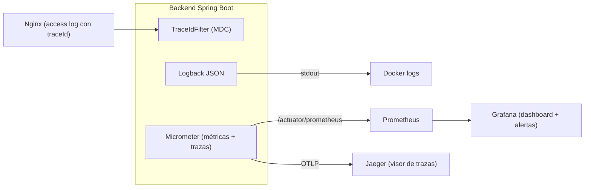

# Observabilidad, Monitoreo e Incidentes

> **Objetivo (TS-05, RNF-06):** poder responder, sin acceder al servidor, tres preguntas: *¿está funcionando?* (salud), *¿qué está pasando?* (métricas y logs) y *¿por qué falló esta petición?* (trazas y `traceId`).
> Relacionados: [Arquitectura §8 y §10](../02-diseno/arquitectura-tecnica.md) · [Seguridad §3 (A09)](seguridad-owasp.md#3-matriz-owasp-top-10-2021) · [DevOps](devops-despliegue.md) · [Estrategia de pruebas §8](estrategia-pruebas.md#8-pruebas-de-carga-y-estrés)

---

## 1. Los tres pilares y cómo se cubren

| Pilar | Pregunta | Tecnología | Evidencia para la sustentación |
|:---|:---|:---|:---|
| **Logs** | ¿Qué ocurrió? | SLF4J + Logback en JSON, MDC (`traceId`) | Log de una petición fallida y su `traceId` |
| **Métricas** | ¿Cuánto y qué tan rápido? | Spring Boot Actuator + Micrometer → Prometheus → Grafana | Dashboard con latencia P95, errores y métricas de negocio |
| **Trazas** | ¿Dónde se fue el tiempo? | Micrometer Tracing + OpenTelemetry (OTLP) | Traza de `POST /solicitudes` con sus *spans* (controlador, servicio, JDBC) |
| **Salud** | ¿Está vivo y listo? | `/actuator/health` (liveness/readiness) | Healthcheck en Docker; apagar BD y mostrar `DOWN` |
| **Alertas** | ¿Debo actuar ya? | Reglas de Prometheus / Grafana Alerting | Alerta disparada en un simulacro |

---

## 2. Arquitectura de observabilidad



Lo **imprescindible** (Must): logs JSON con `traceId`, métricas Prometheus y 3 alertas. Además, en el compose `monitoring`: Grafana (un dashboard) y Jaeger para ver las trazas.

---

## 3. Logs estructurados

### 3.1 Formato

Una línea JSON por evento, a *stdout* (los recoge Docker). Campos fijos:

```json
{ "timestamp": "2026-10-03T15:04:05.123Z", "level": "INFO", "logger": "e.u.s.solicitud.SolicitudService",
  "message": "Solicitud registrada", "traceId": "4bf92f3577b34da6a3ce929d0e0e4736", "spanId": "00f067aa0ba902b7",
  "usuarioId": 7, "rol": "ESTUDIANTE", "metodo": "POST", "ruta": "/api/v1/solicitudes",
  "estado": 201, "duracionMs": 84, "solicitudCodigo": "SOL-2026-0150" }
```

### 3.2 Correlation ID / `traceId` (extremo a extremo)

1. El filtro `TraceIdFilter` acepta `traceparent` (W3C) si llega; si no, genera un `traceId`.
2. Lo coloca en el **MDC** de SLF4J, por lo que aparece en **todos** los logs de esa petición.
3. Lo devuelve en la cabecera `X-Trace-Id` y en el campo `traceId` de **toda** respuesta de error ([RFC 7807](../02-diseno/arquitectura-tecnica.md#8-manejo-centralizado-de-errores)).
4. Nginx incluye el mismo identificador en su *access log*.
5. El frontend, ante un error 5xx, muestra: *"Ocurrió un error inesperado. Código de soporte: `<traceId>`"*.

### 3.3 Niveles y qué registrar

| Nivel | Uso | Ejemplos |
|:---|:---|:---|
| `ERROR` | Fallo que requiere atención | Excepción no controlada (con *stacktrace*), BD inaccesible, fallo al guardar archivo |
| `WARN` | Anomalía recuperable o evento de seguridad | Login fallido, 403, 409 de transición inválida, rate limit |
| `INFO` | Eventos de negocio relevantes | Solicitud creada, transición ejecutada, usuario creado/desactivado, cambio de rol, cambio de contraseña |
| `DEBUG` | Diagnóstico (solo `dev`/`test`) | Parámetros de consultas, tiempos internos |

### 3.4 Qué **nunca** se registra (RNF-13)

Contraseñas (ni en texto ni hasheadas), tokens JWT, `JWT_SECRET`, cuerpos completos de peticiones, contenido de evidencias, datos de tarjetas (no aplica). Los correos se enmascaran en logs de seguridad (`ju***@universidad.edu`). Existe una prueba que busca patrones de secretos en la salida de logs.

### 3.5 Rotación y retención

*Docker* con `max-size=10m, max-file=5` en dev/test.

---

## 4. Métricas

Endpoint: `GET /actuator/prometheus` (solo red interna; [Seguridad §7](seguridad-owasp.md#7-cabeceras-de-seguridad-tls-y-cors)).

### 4.1 Técnicas (automáticas)

| Métrica | Uso |
|:---|:---|
| `http_server_requests_seconds` (por URI, método, estado) | Tasa, errores y **latencia P95/P99** por endpoint (RNF-02) |
| `jvm_memory_used_bytes`, `jvm_gc_pause_seconds`, `jvm_threads_live_threads` | Memoria, GC y saturación |
| `process_cpu_usage`, `system_cpu_usage` | CPU |
| `hikaricp_connections_active/pending/max` | Saturación del pool de BD |
| `up` (Prometheus) | Instancia caída |

Se activan histogramas de percentiles: `management.metrics.distribution.percentiles-histogram.http.server.requests=true`.

### 4.2 De negocio (personalizadas)

| Métrica | Tipo | Etiquetas | Interpretación |
|:---|:---|:---|:---|
| `solicitudes_creadas_total` | Contador | `prioridad`, `area` | Volumen de demanda |
| `solicitudes_transiciones_total` | Contador | `desde`, `hacia` | Flujo del proceso |
| `solicitudes_transicion_invalida_total` | Contador | `desde`, `hacia` | Intentos 409 (posible abuso o *bug* de UI) |
| `solicitudes_pendientes` | *Gauge* | `area` | Backlog actual |
| `solicitudes_vencidas` | *Gauge* | `area` | SLA incumplido (RN-10) |
| `auth_login_total` | Contador | `resultado=ok\|fallido` | Seguridad |
| `evidencias_rechazadas_total` | Contador | `motivo=tipo\|tamano\|firma` | Intentos de subida inválida |

Las métricas de **etiqueta de alta cardinalidad** (id de usuario, código de solicitud) están **prohibidas** en métricas; esos datos van en logs.

---

## 5. Trazas distribuidas (OpenTelemetry)

- Dependencias: `micrometer-tracing-bridge-otel` y `opentelemetry-exporter-otlp`; muestreo 100 % en *staging*, 10 % en *prod*.
- Se generan *spans* automáticos para HTTP entrante, consultas JDBC y llamadas salientes.
- Propagación **W3C Trace Context** (`traceparent`); Nginx lo reenvía; el frontend puede iniciar el `traceparent` en `apiClient`.
- Visualización: Jaeger (compose `monitoring`). Mínimo exigible: el `traceId` correlacionado con logs.
- **Caso de demostración:** una creación de solicitud lenta se diagnostica abriendo su traza y localizando el *span* más largo (p. ej. `INSERT evidencias`).

---

## 6. Alertas

Reglas mínimas (Prometheus `alert-rules.yml` o Grafana Alerting). Severidad: **SEV1** crítico, **SEV2** alto, **SEV3** aviso (§7.1).

| Alerta | Condición (PromQL aproximado) | Para | Sev | Acción inicial |
|:---|:---|:---:|:---:|:---|
| **InstanciaCaida** | `up{job="backend"} == 0` | 1 min | SEV1 | Revisar `docker ps`, logs, reiniciar; escalar al Rol 6 |
| **ErrorRate5xxAlto** | `sum(rate(http_server_requests_seconds_count{status=~"5.."}[5m])) / sum(rate(http_server_requests_seconds_count[5m])) > 0.05` | 5 min | SEV1 | Buscar `traceId` de errores en logs; revisar último despliegue; *rollback* si coincide |
| **BDInaccesible** | `/actuator/health` con `db != UP` | 1 min | SEV1 | Revisar contenedor `db`, disco, credenciales |

**Requisito de evidencia:** **3** alertas activas (`InstanciaCaida`, `ErrorRate5xxAlto` y `BDInaccesible`) y **un simulacro documentado** (p. ej. detener el backend y mostrar `InstanciaCaida` disparada y su resolución).

Las alertas se ven en Prometheus/Grafana. Durante el periodo de demo, la guardia la rota el equipo (Rol 6 titular, Rol 1 suplente).

---

## 7. Gestión de incidentes

### 7.1 Severidades

| Sev | Definición | Ejemplos | Objetivo de respuesta |
|:---:|:---|:---|:---:|
| **SEV1** | Servicio caído o pérdida/exposición de datos | Backend/BD caídos; tasa de 5xx > 5 %; secreto filtrado | Inmediata; resolver o mitigar ≤ 1 h |
| **SEV2** | Funcionalidad importante degradada | Latencia P95 > 300 ms sostenida; fallo en subida de archivos | ≤ 4 h |
| **SEV3** | Impacto menor o aviso | Un endpoint no crítico con errores; alerta de backlog | Siguiente día hábil |

### 7.2 Procedimiento

1. **Detectar:** alerta o reporte de usuario con su código de soporte (`traceId`).
2. **Clasificar** (SEV) y asignar un **responsable del incidente**.
3. **Diagnosticar** con la secuencia de §9.
4. **Mitigar** primero (reiniciar, *rollback*, desactivar función) y corregir la causa después.
5. **Comunicar** el estado al equipo (y al docente si afecta la demo).
6. **Cerrar** y redactar *post-mortem* en 48 h para SEV1/SEV2.

### 7.3 Plantilla de *post-mortem* (sin culpables)

```markdown
## Incidente INC-YYYYMMDD-NN — <título>
- Severidad / Duración / Impacto:
- Línea de tiempo (UTC): detección → diagnóstico → mitigación → resolución
- Causa raíz (5 porqués):
- Qué funcionó / qué no:
- Acciones correctivas (con responsable y fecha): …
- Evidencia: capturas de alertas, `traceId`s, commits
```
Los incidentes reales o simulados se archivan en `docs/incidentes/`.

### 7.4 Runbooks breves

| Síntoma | Comprobación | Acción |
|:---|:---|:---|
| Frontend responde 502 | `docker ps`, `docker logs backend`, `/actuator/health` | Reiniciar `backend`; si persiste, revisar BD y variables de entorno |
| Muchos 401 tras un despliegue | ¿Cambió `JWT_SECRET`? | Restaurar el secreto o pedir a los usuarios iniciar sesión de nuevo |
| Latencia alta | Dashboard: CPU, pool HikariCP, consultas lentas (`slow_query_log`) | Optimizar consulta/índice; escalar réplicas |
| Subida de archivos falla | Espacio en disco, permisos del volumen, límite de Nginx (413) | Liberar espacio; revisar `client_max_body_size` |
| Alertas de logins fallidos | Origen por IP en el log de Nginx | Bloquear la IP en Nginx |

---

## 8. Dashboards (Grafana)

Provisionados desde `ops/grafana/dashboards/`:

| Dashboard | Paneles clave |
|:---|:---|
| **Salud del servicio** | Estado de instancias, tasa de peticiones, % de errores 4xx/5xx, latencia P50/P95/P99 por endpoint, CPU, memoria JVM, pool de BD |

---

## 9. Depuración con observabilidad (guion)

Cuando alguien reporta *"me salió un error"*:

1. Pedir el **código de soporte** (`traceId`) que muestra la pantalla de error.
2. Buscar en logs: `docker logs backend | grep <traceId>`.
3. Leer el `ERROR` con *stacktrace* y el contexto (usuario, ruta, estado).
4. Si es un problema de rendimiento, abrir la **traza** y localizar el *span* más lento.
5. Cruzar con **métricas** del momento (¿pico de CPU? ¿pool saturado? ¿despliegue reciente?).
6. Reproducir con una prueba automatizada que falle; corregir; el PR referencia el `traceId` y el incidente.

---

## 10. Configuración de referencia (a implementar en TASK-020)

```yaml
# application.yml (fragmento) — todo valor sensible por ${VARIABLE}
management:
  endpoints:
    web:
      exposure:
        include: health, info, prometheus
  endpoint:
    health:
      probes: { enabled: true }          # /actuator/health/liveness y /readiness
      show-details: when-authorized
  metrics:
    distribution:
      percentiles-histogram:
        http.server.requests: true
  tracing:
    sampling:
      probability: ${TRACING_SAMPLE_RATE:0.1}
logging:
  structured:
    format:
      console: logstash                   # salida JSON (Spring Boot 3.4+); alternativa: logstash-logback-encoder
```

*Nota:* si la versión de Spring Boot usada no incluye `logging.structured`, se usa `logstash-logback-encoder` en `logback-spring.xml`. En `prod`, `management.endpoints` expone `prometheus` solo en un puerto/red interna.

---

## 11. Criterios de aceptación de observabilidad

| # | Criterio | Verificación |
|:-:|:---|:---|
| 1 | 100 % de las respuestas llevan `X-Trace-Id` | Prueba automatizada sobre varios endpoints |
| 2 | Una excepción no controlada devuelve 500 genérico + `traceId` y deja el *stacktrace* en logs con el mismo `traceId` | Prueba de integración con excepción forzada |
| 3 | `/actuator/prometheus` expone métricas HTTP y de negocio | `curl` interno |
| 4 | Dashboards provisionados cargan sin pasos manuales | `docker compose --profile monitoring up` |
| 5 | ≥ 3 alertas activas y un simulacro documentado | Capturas + post-mortem de simulacro |
| 6 | Ningún secreto/PII sensible en logs | Prueba de búsqueda de patrones en logs de la suite |
