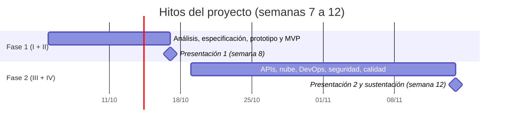
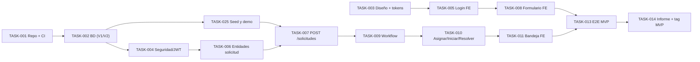

# Calendario, Hitos y Contingencia

> **Fuente única del calendario.** El detalle por tarea (193 issues, milestones y dependencias) vive en el [backlog](../backlog/milestones.md); aquí solo están el calendario, los hitos, la ruta crítica, la contingencia y el cumplimiento del ciclo exigido.
> Relacionados: [Documento del proyecto (riesgos)](../01-definicion/documento-proyecto.md#6-riesgos-del-proyecto) · [SRS §7 (alcance MVP)](../01-definicion/especificaciones-tecnicas.md#7-alcance-del-mvp-17102026) · [Equipo y roles](equipo-y-flujo-de-trabajo.md) · [Gobernanza Git](equipo-y-flujo-de-trabajo.md)

---

## 1. Calendario y hitos

> **Calendario actualizado (03/10/2026).** El curso fijó **dos únicas presentaciones**: la de la **semana 8 (17/10)**, que cubre las fases I + II del enunciado, y la de la **semana 12 (14/11)**, que cubre las fases III + IV. Las fechas anteriores (11/10, 31/10, 21/11 y 12/12) **ya no se usan**. El detalle por tarea está en [`backlog/milestones.md`](../backlog/milestones.md).

### 1.1 Calendario vigente

- **El ciclo del curso dura 16 semanas** (semana 1 = 24 de agosto de 2026; *deducción a partir de las fechas del plan: confirmar con el docente/Classroom*).
- **Este proyecto se ejecuta desde la semana 7** (5 de octubre). Las semanas 1–6 (24/08–03/10) fueron de contenido del curso/formación de grupos.
- **Presentación 1 — semana 8, 17/10/2026:** fases **I + II** (análisis, especificación, prototipo y **MVP funcional**).
- **Presentación 2 — semana 12, 14/11/2026:** fases **III + IV** (APIs, nube, DevOps, seguridad, calidad, observabilidad, release y sustentación con demostración integral).
- Las semanas 13–16 no tienen entregables: quedan como colchón.

> ⚠️ **Riesgo de capacidad:** la Fase 1 tiene solo ~12 días (05–17/10) para el análisis y el MVP completo. Si el avance real no alcanza, se aplica el [plan de contingencia (§7)](#5-plan-de-contingencia-qué-se-recorta-y-en-qué-orden).

### 1.2 Semanas del ciclo

| Sem | Fechas (lun–sáb) | Fase | Sprint |
|:--:|:---|:---|:---:|
| 6 | 28/09 – 03/10 | *(actual)* — documentación y decisiones | — |
| **7** | 05/10 – 10/10 | **Fase 1** — análisis, especificación, prototipo y base del MVP | S1 |
| **8** | 12/10 – 17/10 | Fase 1 → **presentación 1 (17/10)** | S1 |
| **9** | 19/10 – 24/10 | **Fase 2** — APIs, nube, DevOps, seguridad | S2 |
| **10** | 26/10 – 31/10 | Fase 2 | S2 |
| **11** | 02/11 – 07/11 | Fase 2 — calidad, observabilidad, performance | S3 |
| **12** | 09/11 – 14/11 | Fase 2 → **presentación 2 y sustentación final (14/11)** | S3 |
| 13–16 | 16/11 – 12/12 | Sin entregables (colchón) | — |

### 1.3 Hitos

| Hito | Fecha | Producto (según enunciado) | Entregable |
|:---|:---:|:---|:---|
| **Hito 1 — Fase 1 (fases I + II)** | **17/10/2026** (semana 8) | Diseño y especificación + **MVP funcional** end-to-end | Informe de la Fase 1 ([índice](../05-entregables/informes-y-sustentacion.md#7-informe-de-la-fase-i--análisis-especificación-y-prototipo) + [plantilla §2](../05-entregables/informes-y-sustentacion.md#2-plantilla-del-informe-de-la-fase-1)), tag `v0.5.0-mvp` y demostración |
| **Hito 2 — Fase 2 (fases III + IV)** | **14/11/2026** (semana 12) | Release final `v1.0.0` desplegado, API documentada, CI/CD, seguridad, pruebas, observabilidad | Informe final + exposición con demostración integral |

*Dentro de la Fase 2, el Release Candidate `v0.9.0-rc.1` se etiqueta el 04/11 como punto de control interno.*

---

## 2. Sprints

Sprints de 2 semanas ([ceremonias](equipo-y-flujo-de-trabajo.md#5-ceremonias-ágiles)). Cada sprint tiene un **objetivo** verificable y un **criterio de salida**. El detalle por *milestone* (`1.1`…`2.8`) está en [`backlog/milestones.md`](../backlog/milestones.md).

| Sprint | Fechas | Objetivo | Alcance principal (US) | Criterio de salida |
|:---:|:---|:---|:---|:---|
| **S1** | 05/10 – 17/10 | **Fase 1: MVP end-to-end** | Setup repo/CI, BD, diseño UX + maqueta, **auth** (US-01…04), **registro de solicitud** (BE + UI), **asignar → iniciar → resolver**, historial, pruebas, informe y demo | Flujo MVP demostrado; informe de la Fase 1; tag `v0.5.0-mvp`; presentación del 17/10 |
| **S2** | 19/10 – 31/10 | Plataforma desplegable y datos | Docker, CI, **dashboard** (BE+FE), cierre, OpenAPI, seguridad CI, cambio de contraseña, **administración** y comentarios | `docker compose up` OK; dashboard con las 9 métricas; CI de seguridad; administración funcionando |
| **S3** | 02/11 – 14/11 | **Release** y observabilidad | Cloud y CD a *staging*, hardening OWASP, RC, métricas/logs/trazas/alertas, carga/estrés, DAST, UAT y usabilidad, manuales, informe de pruebas, congelamiento, ensayo | `v1.0.0` desplegado; 0 críticos/altos de seguridad; informe final; demo ensayada y presentada el 14/11 |

> Los sprints y las dos fases **coinciden solo en el primero** (S1 = Fase 1); la Fase 2 abarca S2 y S3. El Scrum Master gestiona los hitos con los 14 *milestones* de GitHub.

---

## 3. Alcance del MVP y dependencias críticas

### 3.1 Qué demuestra el MVP (17/10)

**Login → registrar solicitud → guardar en MySQL → consultar solicitud → modificar estado**, con roles. Alcance exacto en [SRS §7](../01-definicion/especificaciones-tecnicas.md#7-alcance-del-mvp-17102026).

### 3.2 Dependencias críticas (ruta crítica)

> `TASK-xxx` son las etiquetas de la planificación original; su equivalencia con los issues está en la [tabla del backlog](../backlog/README.md#equivalencia-task--issues).

**Puntos de bloqueo conocidos y su mitigación:**

| Dependencia | Riesgo | Mitigación |
|:---|:---|:---|
| Registrar solicitud necesita categorías, áreas y prioridades | El CRUD de catálogos llega en TASK-018 (31/10), tras el MVP | `V2__datos_maestros.sql` los siembra desde el primer día; TASK-025 añade usuarios demo |
| El frontend depende de endpoints del backend | Bloqueo cruzado en S1–S2 | Contrato [API REST](../02-diseno/api-rest.md) primero; el frontend usa **MSW/mocks** hasta que el endpoint exista |
| Todos dependen de la seguridad JWT (TASK-004) | Retrasa todo el backend | Prioridad máxima del Rol 1; entrega temprana de un `JwtService` mínimo y un usuario de pruebas |
| Elección de cloud (ADR-007) | Bloquea CD y DAST | **Decidir antes del 23/10**; plan B: Docker Compose local documentado |

---

## 4. Entregables por fase del enunciado

| Fase | Producto exigido | Cómo se cumple | Fecha |
|:---|:---|:---|:---:|
| **I** Análisis, especificación y prototipo | Documento del proyecto; problema, objetivos, actores, alcance, arquitectura preliminar; épicas, HU, división, tareas, criterios, specs, BDD; wireframes, mockups, prototipo, DOM/CSS/JS, responsive, usabilidad; uso responsable de IA | [Documento del proyecto](../01-definicion/documento-proyecto.md) · [SRS](../01-definicion/especificaciones-tecnicas.md) · [specs/](../../specs/README.md) · [UX/UI](../01-definicion/ux-ui-prototipo.md) · [Registro IA](ia-register.md) · [Informe de Fase I](../05-entregables/informes-y-sustentacion.md#7-informe-de-la-fase-i--análisis-especificación-y-prototipo) | 17/10 |
| **II** Construcción full-stack | MVP funcional: React, Spring Boot, DTO, validaciones, capas, MySQL, CRUD, GET/POST/PUT/DELETE, `fetch`, estado, cookies, `localStorage`/`sessionStorage` | Código en `backend/` y `frontend/`; [ADR-004](../02-diseno/decisiones-arquitectura.md#adr-004--jwt-de-8-horas-sin-refresh-token) (storage y cookie) | 17/10 |
| **III** APIs, nube, DevOps, seguridad | Cloud + CI/CD, Docker, ambientes, REST documentada, pruebas de API, panorama GraphQL/gRPC/webhooks, API Gateway, seguridad, testing, IA en pruebas | [DevOps](../03-calidad-y-operacion/devops-despliegue.md) · [API REST](../02-diseno/api-rest.md) · [Seguridad](../03-calidad-y-operacion/seguridad-owasp.md) · [Pruebas](../03-calidad-y-operacion/estrategia-pruebas.md) | 14/11 |
| **IV** Calidad, performance, observabilidad y entrega | Pruebas funcionales/aceptación/usuario/seguridad, SAST/DAST, carga/estrés, informe de pruebas, observabilidad, revisión final, release, manuales, demostración | [Pruebas](../03-calidad-y-operacion/estrategia-pruebas.md) · [Observabilidad](../03-calidad-y-operacion/observabilidad.md) · [Entregables](../05-entregables/informes-y-sustentacion.md) | 14/11 |

---

---

## 5. Plan de contingencia (qué se recorta y en qué orden)

Si el calendario se pone en riesgo, el Scrum Master propone recortar **de abajo hacia arriba** (nunca los *Must* del enunciado):

| Orden de recorte | Elemento | Prioridad | Impacto del recorte |
|:---:|:---|:---:|:---|
| 1 | Comentarios (US-27) | S | Se comunican fuera del sistema |
| 2 | Reasignación y "crear en nombre de terceros" | C | Solo asignación inicial |
| 3 | Cambio de contraseña (US-18) | S | El administrador define la contraseña inicial |
| — | **No se recortan:** auth, registro, gestión, dashboard, administración, Docker, CI/CD, OWASP básico, pruebas, observabilidad mínima, registro de IA, manuales, demo | M | — |

---

> **Recortes ya aplicados (03/10/2026):** notificaciones, recuperación de contraseña, bloqueo por intentos, estados `Rechazada`/`Cancelada`, reabrir y calificación (el enunciado define 6 estados), triaje semanal, prueba de *rollback*, Loki/Tempo, plan B de la demo, Lighthouse, ZAP *full scan* y respaldos de BD. Detalle en el [backlog](../backlog/README.md#alcance-recortado).

---

## 6. Cumplimiento del ciclo exigido

El enunciado evalúa **Especificar → Diseñar → Construir → Integrar → Probar → Asegurar → Desplegar → Monitorear → Mejorar**:

| Etapa | Evidencia principal | Semana |
|:---|:---|:---:|
| **Especificar** | SRS, specs, BDD, trazabilidad | 7 |
| **Diseñar** | Arquitectura, ADRs, modelo de datos, UX/UI, API | 7 |
| **Construir** | Backend y frontend por HU | 7–8 |
| **Integrar** | E2E del MVP; contrato OpenAPI; CI | 8 |
| **Probar** | Unitarias, integración, API, aceptación, usuario | 8–12 |
| **Asegurar** | OWASP, SAST/DAST, secretos | 9–12 |
| **Desplegar** | Docker, CD a staging/prod | 9–11 |
| **Monitorear** | Logs, métricas, trazas, alertas, simulacro | 11–12 |
| **Mejorar** | Retrospectivas, post-mortem, informe final (acciones de mejora) | 11–12 |

---
